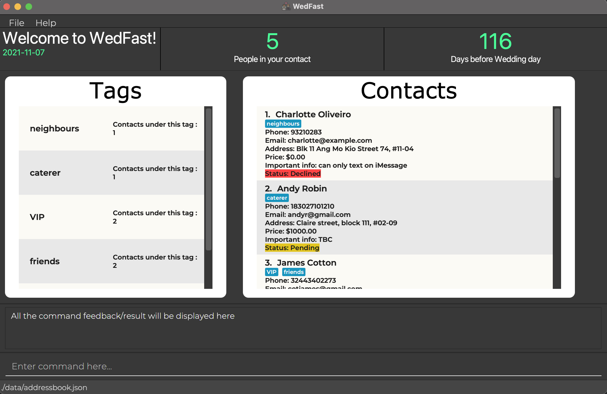

### Introduction

* WedFast is a **desktop app for organising weddings, optimized for use via a Command Line
  Interface** (CLI) while still having the benefits of a Graphical User Interface (GUI). If you can type
  fast, WedFast can get your contact management tasks done faster than traditional GUI apps.

* The project simulates an ongoing software project for a desktop application (called _AddressBook_) used for managing contact details.
  * It is **written in OOP fashion**. It provides a **reasonably well-written** code base.
  * It comes with a **reasonable level of user and developer documentation**.
* For the detailed documentation of this project, see the **[WedFast Product Website](https://ay2122s1-cs2103t-w10-4.github.io/tp/)**.

### Acknowledgement
* This project is based on the AddressBook-Level3 project created by the [SE-EDU initiative](https://se-education.org),
inherited and continue optimized by AY2122S1-CS2103T-W10-4 developers.

