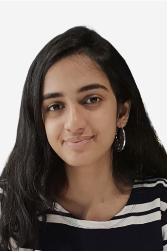
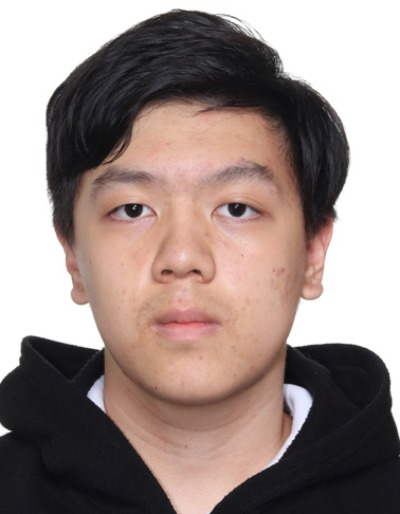
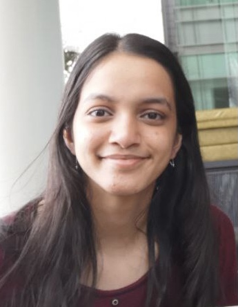

We are a team based in the [School of Computing, National University of Singapore](http://www.comp.nus.edu.sg).

You can reach us at the email `seer[at]comp.nus.edu.sg`

## Project team

### Ravi Ananya

[[homepage](http://www.comp.nus.edu.sg/~damithch)]
[[github](https://github.com/johndoe)]
[[portfolio](team/johndoe.md)]

* Role: Project Advisor

### Shui Jie

[[github](https://github.com/sj1999-BIT)]
[[portfolio](team/sj1999-bit.md)]

* Role: developer
* Responsibilities: Add filter contact, add group contact

### Ruohang Yin

[[github](http://github.com/yin72257)] [[portfolio](team/ruohang.md)]

* Role: Developer
* Responsibilities: Data

### Linda Tom

[[github](http://github.com/johndoe)]
[[portfolio](team/johndoe.md)]

* Role: Developer
* Responsibilities: Dev Ops + Threading

### Desmond To Cie Hong

[[github](http://github.com/desmondto)]
[[portfolio](team/desmondto.md)]

* Role: Developer
* Responsibilities: UI
