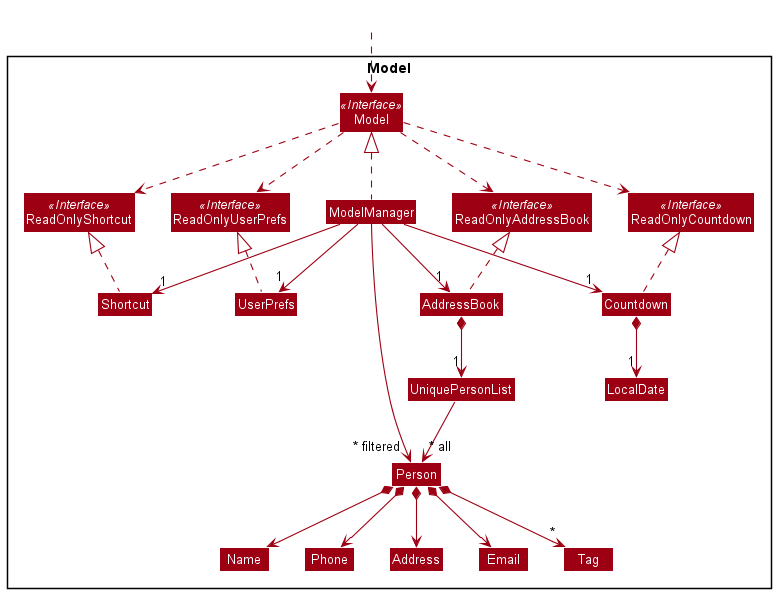
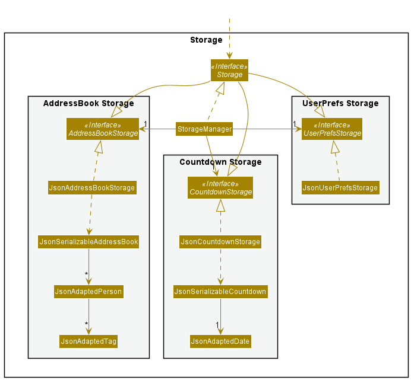

* Table of Contents
{:toc}

--------------------------------------------------------------------------------------------------------------------

## **Acknowledgements**

* {list here sources of all reused/adapted ideas, code, documentation, and third-party libraries -- include links to the original source as well}

--------------------------------------------------------------------------------------------------------------------

## **Setting up, getting started**

Refer to the guide [_Setting up and getting started_](SettingUp.md).

--------------------------------------------------------------------------------------------------------------------

## **Design**

:bulb: **Tip:** The `.puml` files used to create diagrams in this document can be found in the [diagrams](https://github.com/se-edu/addressbook-level3/tree/master/docs/diagrams/) folder. Refer to the [_PlantUML Tutorial_ at se-edu/guides](https://se-education.org/guides/tutorials/plantUml.html) to learn how to create and edit diagrams.

### Architecture

The ***Architecture Diagram*** given above explains the high-level design of the App.

Given below is a quick overview of main components and how they interact with each other.

**Main components of the architecture**

**`Main`** has two classes called [`Main`](https://github.com/se-edu/addressbook-level3/tree/master/src/main/java/seedu/address/Main.java) and [`MainApp`](https://github.com/se-edu/addressbook-level3/tree/master/src/main/java/seedu/address/MainApp.java). It is responsible for,
* At app launch: Initializes the components in the correct sequence, and connects them up with each other.
* At shut down: Shuts down the components and invokes cleanup methods where necessary.

[**`Commons`**](#common-classes) represents a collection of classes used by multiple other components.

The rest of the App consists of four components.

* [**`UI`**](#ui-component): The UI of the App.
* [**`Logic`**](#logic-component): The command executor.
* [**`Model`**](#model-component): Holds the data of the App in memory.
* [**`Storage`**](#storage-component): Reads data from, and writes data to, the hard disk.

**How the architecture components interact with each other**

The *Sequence Diagram* below shows how the components interact with each other for the scenario where the user issues the command `delete 1`.

Each of the four main components (also shown in the diagram above),

* defines its *API* in an `interface` with the same name as the Component.
* implements its functionality using a concrete `{Component Name}Manager` class (which follows the corresponding API `interface` mentioned in the previous point.

For example, the `Logic` component defines its API in the `Logic.java` interface and implements its functionality using the `LogicManager.java` class which follows the `Logic` interface. Other components interact with a given component through its interface rather than the concrete class (reason: to prevent outside component's being coupled to the implementation of a component), as illustrated in the (partial) class diagram below.

The sections below give more details of each component.

### UI component

The **API** of this component is specified in [`Ui.java`](https://github.com/se-edu/addressbook-level3/tree/master/src/main/java/seedu/address/ui/Ui.java)

The UI consists of a `MainWindow` that is made up of parts e.g.`CommandBox`, `ResultDisplay`, `PersonListPanel`, `StatusBarFooter` etc. All these, including the `MainWindow`, inherit from the abstract `UiPart` class which captures the commonalities between classes that represent parts of the visible GUI.

The `UI` component uses the JavaFx UI framework. The layout of these UI parts are defined in matching `.fxml` files that are in the `src/main/resources/view` folder. For example, the layout of the [`MainWindow`](https://github.com/se-edu/addressbook-level3/tree/master/src/main/java/seedu/address/ui/MainWindow.java) is specified in [`MainWindow.fxml`](https://github.com/se-edu/addressbook-level3/tree/master/src/main/resources/view/MainWindow.fxml)

The `UI` component,

* executes user commands using the `Logic` component.
* listens for changes to `Model` data so that the UI can be updated with the modified data.
* keeps a reference to the `Logic` component, because the `UI` relies on the `Logic` to execute commands.
* depends on some classes in the `Model` component, as it displays `Person` object residing in the `Model`.

### Logic component

**API** : [`Logic.java`](https://github.com/se-edu/addressbook-level3/tree/master/src/main/java/seedu/address/logic/Logic.java)

Here's a (partial) class diagram of the `Logic` component:

How the `Logic` component works:
1. When `Logic` is called upon to execute a command, it uses the `AddressBookParser` class to parse the user command.
1. This results in a `Command` object (more precisely, an object of one of its subclasses e.g., `AddCommand`) which is executed by the `LogicManager`.
1. The command can communicate with the `Model` when it is executed (e.g. to add a person).
1. The result of the command execution is encapsulated as a `CommandResult` object which is returned back from `Logic`.

The Sequence Diagram below illustrates the interactions within the `Logic` component for the `execute("delete 1")` API call.

:information_source: **Note:** The lifeline for `DeleteCommandParser` should end at the destroy marker (X) but due to a limitation of PlantUML, the lifeline reaches the end of diagram.

Here are the other classes in `Logic` (omitted from the class diagram above) that are used for parsing a user command:

How the parsing works:
* When called upon to parse a user command, the `AddressBookParser` class creates an `XYZCommandParser` (`XYZ` is a placeholder for the specific command name e.g., `AddCommandParser`) which uses the other classes shown above to parse the user command and create a `XYZCommand` object (e.g., `AddCommand`) which the `AddressBookParser` returns back as a `Command` object.
* All `XYZCommandParser` classes (e.g., `AddCommandParser`, `DeleteCommandParser`, ...) inherit from the `Parser` interface so that they can be treated similarly where possible e.g, during testing.

### Model component
**API** : [`Model.java`](https://github.com/se-edu/addressbook-level3/tree/master/src/main/java/seedu/address/model/Model.java)

The `Model` component,

* stores the address book data i.e., all `Person` objects (which are contained in a `UniquePersonList` object).
* stores the currently 'selected' `Person` objects (e.g., results of a search query) as a separate _filtered_ list which is exposed to outsiders as an unmodifiable `ObservableList<Person>` that can be 'observed' e.g. the UI can be bound to this list so that the UI automatically updates when the data in the list change.
* stores the countdown data i.e., a `Countdown` object.
* stores a `UserPref` object that represents the user’s preferences. This is exposed to the outside as a `ReadOnlyUserPref` objects.
* does not depend on any of the other three components (as the `Model` represents data entities of the domain, they should make sense on their own without depending on other components)

:information_source: **Note:** An alternative (arguably, a more OOP) model is given below. It has a `Tag` list in the `AddressBook`, which `Person` references. This allows `AddressBook` to only require one `Tag` object per unique tag, instead of each `Person` needing their own `Tag` objects. 

### Storage component

**API** : [`Storage.java`](https://github.com/se-edu/addressbook-level3/tree/master/src/main/java/seedu/address/storage/Storage.java)

The `Storage` component,
* can save both address book data, user preference data, countdown data, and shortcut data in json format, and read them back into corresponding objects.
* inherits from both `AddressBookStorage`, `UserPrefStorage`, `CountdownStorage`, and `ShortcutStorage` which means it can be treated as either of them (if only the functionality of only one is needed).
* can save address book data, countdown data, shortcut data, and user preference data in json format, and read them back into corresponding objects.
* depends on some classes in the `Model` component (because the `Storage` component's job is to save/retrieve objects that belong to the `Model`)

### Common classes

Classes used by multiple components are in the `seedu.addressbook.commons` package.

--------------------------------------------------------------------------------------------------------------------

## **Implementation**

This section describes some noteworthy details on how certain features are implemented.

### Find by Tag and Price feature
#### Implementation
Finding by Tag and Price is a combinatory feature implemented by `Predicates`. The predicate for tags is `TagContainsKeywordsPredicate`.

Finding by price range uses three different predicates.

1. `PriceEqualsNumberPredicate` for to find equal to price
2. `PriceGreaterThanNumberPredicate` for to find greater than certain price
3. `PriceLessThanNumberPredicate` for to find less than certain price

The 5 operators =, <, >, >=, <= are implemented using the above predicates.

| Operator | Predicate |
| ------------- | ------------- |
| =  | `PriceEqualsNumberPredicate`  |
| >  | `PriceGreaterThanNumberPredicate`  |
| <  | `PriceLessThanNumberPredicate`  |
| >=  | `PriceEqualsNumberPredicate \|\| PriceGreaterThanNumberPredicate`  |
| <=  | `PriceEqualsNumberPredicate \|\| PriceLessThanNumberPredicate`  |

The following activity diagram summarizes what happens when a user executes a find command:

#### Design considerations:
**Aspect: How each predicate is combined together:**

* **Alternative 1 (current choice):** Queried list of contacts must fit all three criterias at once.
    * Pros: It is likely user would use this feature more as it narrows the scope of the query
    * Cons: Some users may misinterpret the functionality and be confused
* **Alternative 2:** Queried list of contacts can fit any of the three criterias
    * Pros: Consistent with how multiple names work with the `find [NAMES]` function
    * Cons: Less likely to be used as additional parameters won't increase effectiveness of query.

### Shortcut features
#### Implementation
The shortcut implementation is facilitated by a Shortcut module with four commands: `sc`, `addsc`, `removesc`, and `listsc`. Each responsible for the call shortcut, add shortcut, remove shortcut, and list shortcut functions respectively. 

`Shortcut` mechanism is similar to `AddressBook` but instead stores a `HashMap<String, String>` of shortcuts corresponding to its `key` and `commandString`. To store it in JSON, `JsonShortcutStorage` use `JsonSerializableShortcut` to read and write from the JSON file. The storage architecture can be seen in the diagram above.

Given below is an example usage scenario and how the shortcut mechanisms behaves at each step.

Step 1. The user launches the applicatio nand has the following person list saved. `Shortcut` stores this in the shortcutMap.

Step 2. The user executes `sc f` to call the shortcut `f` leading to the command `find pr/>0.00` to be called. The `sc` command first calls `Model#getShortcutFromKey()` to obtain the command from the model.

Step 3. The `sc` command takes this new command and parses it in the `AddressBookParser`. If this succeeds command in the `commandString` is executed on the same model.  

Below is a simplified sequence diagram showing how a `ShortcutCommand` would interact with the logic component. The interactions of the `FindCommand` stored in the `commandString` is simpified as the main focus of this diagram is the shortcut functionality.

The following activity diagram summarizes what happens when a user executes a shortcut-keyword command:

### Delete by name feature
#### Implementation
The delete-by-name mechanism is facilitated by `AddressBook`. It implements `ReadOnlyAddressBook` with a person list, stored internally as an `persons`. Additionally, it implements the following operation:

* `AddressBook#removePerson()` — Removes specified person from its person list.

The operation is exposed in the `Model` interface as `Model#deletePerson()`.

Given below is an example usage scenario and how the delete-by-name mechanism behaves at each step.

Step 1. The user launches the application and has the following person list saved. `AddressBook` stores these contacts as `persons`.

Step 2. The user executes `delete n/John Doe` command to delete the person named *John Doe* in the list.
The `delete` command first calls `Model#updateFilteredPersonList()` and `Model#getFilteredPersonList()` to get a list where all the persons in the list named *John Doe*.

Step 3. With the access to the filtered list, it calls `Model#deletePerson()`, causing `AddressBook` to remove each person in the
list by calling `AddressBook#removePerson()`. Finally, the user will see the updated person list with *John Doe* removed.

:information_source: **Note:** If a name is not found, it will not call `Model#deletePerson()`, so the `AddressBook` person list will not be modified.

The following sequence diagram shows how the delete-by-name operation works:

:information_source: **Note:** The lifeline for `DeleteCommandParser` should end at the destroy marker (X) but due to a limitation of PlantUML, the lifeline reaches the end of diagram.

The following activity diagram summarizes what happens when a user executes a set-wedding-countdown command:

#### Design considerations:

**Aspect: How delete-by-name executes:**

* **Alternative 1 (current choice):** Deletes the person with the exact same name.
    * Pros: Avoid the situation where user deletes the wrong person
    * Cons: User needs to remember the name precisely.
* **Alternative 2:** Deletes the person who names partially contains the specified name.
    * Pros: User does not have to remember the full name (e.g. `delete n/Alex` will delete both person named *Alex Tan* and *Alex Yeoh*).
    * Cons: Might delete the wrong person.

_{more aspects and alternatives to be added}_

### Countdown to the wedding day feature
#### Implementation
The countdown mechanism is facilitated by `Countdown`. It implements `ReadOnlyCountdown` with a wedding date, stored internally as `weddingDate`. Additionally, it implements the following operation:

* `Countdown#setData()` — Replaces the existing wedding date with a new date.
* `Countdown#getDate()` — Returns an unmodifiable view of the wedding date.

The operation is exposed in the `Model` interface as `Model#setDate()` and `Model#getWeddingDate()`.

Given below is an example usage scenario and how the countdown mechanism behaves at each step.

Step 1. The user launches the application and never set wedding date before. `Countdown` automatically stores today's date as `weddingDate`. Say today is `4 November 2021`.

Step 2. The user executes `countdown 2022-05-20` command to set his/her wedding date to `20 May 2022`.
The `countdown` command then calls `Model#setDate()` to set the wedding date to `20 May 2022`.

Step 3. With this updated wedding date, the user executes `countdown` (without argument) command to see the number of 
days left until his/her wedding above the command box.

Step 4. The user can also view the countdown at the right top corner of the app immediately after updating the wedding
date.

:information_source: **Note:** If the date specified has passed, it will 
not call `Model#setDate()`, so the `Countdown` wedding date will not be modified.

The following sequence diagram shows how the set-wedding-date-for-countdown operation works:

:information_source: **Note:** The lifeline for `CountdownCommandParser` should end at the destroy marker (X) but due to a limitation of PlantUML, the lifeline reaches the end of diagram.

The following activity diagram summarizes what happens when a user executes a delete-by-name command:

#### Design considerations:

**Aspect: How setting wedding date for countdown executes:**

* **Alternative 1 (current choice):** Does not allow setting past date as wedding date.
    * Pros: Fit for the purpose of the app: planning for future wedding.
    * Cons: Cannot track how many days has passed since the wedding.
* **Alternative 2:** Allow setting past date as wedding date.
    * Pros: Can track how many days has passed since the wedding.
    * Cons: Does not fit for the purpose of the app: planning for future wedding.

_{more aspects and alternatives to be added}_

### Cost sum checking feature
#### Implementation
The cost sum checking mechanism is facilitated by `Model`. It implements the following operation:

* `Model#updateFilteredPersonList()` — Filters the person list with specified condition(s).

Given below is an example usage scenario and how the cost sum checking mechanism behaves at each step.

Step 1. The user launches the application and wants to check the total expenses for certain categories. Let say he/she
has the following contacts stored.

:information_source: **Note:** 
A contact's `status` indicates whether the user has confirmed to hire this person/ the user is sure that this person will
attend his/her wedding. Therefore, based on the diagram above, the user has **confirmed** to hire `Bernice Yu` as his/her
**florist** with the cost of **300.00 dollars**.

Step 2. The user executes `price t/Florist Photographer` command to check the expenses under `Florist` and `Photographer`
category. The `price` command first calls `Model#updateFilteredPersonList()` to get all the contacts with `confirmed`
status.

Step 3. With this filtered list, `price` command then further filters out person(s) with either `Florist` or `Photographer` 
tags. Then, it calculates the total sum of `price` for each contact(s) in this filtered list.

Step 4. Finally, the user can view the calculation result right above the command box.

Step 4. The user then checks the total cost of his/her wedding by executing `price` command (without any argument). Hence,
`price` command will just sum up all the `price` for all the contacts with `confirmed` status. The only contacts with 
`confirmed` status are `Alex Yeoh` and `Bernice Yu`, respectively hired by the user with the cost **650.00 dollars** and
**300.00 dollars**. Hence, the total is **950.00** dollars.

:information_source: **Note:** If the category(tag) specified is not found,
then the cost under that category is considered as **0.00 dollar** and will not be added to the sum.

The following sequence diagram shows how the cost-sum-checking operation works:

:information_source: **Note:** The lifeline for `PriceCommandParser` should end at the destroy marker (X) but due to a limitation of PlantUML, the lifeline reaches the end of diagram.

#### Design considerations:

**Aspect: How cost-sum-checking operation executes:**

* **Alternative 1 (current choice):** Does not calculate the cost for those who has not confirmed yet.
    * Pros: Gives an exact number on those categories the user confirms to spend money on.
    * Cons: The total sum does not include the potential expenses, i.e. cost for persons with `pending` status.
* **Alternative 2:** Calculate the cost for those who has not confirmed yet.
    * Pros: The total sum includes the potential expenses, i.e. cost for persons with `pending` status.
    * Cons: Does not give an exact number on those categories the user confirms to spend money on.

_{more aspects and alternatives to be added}_

### \[Proposed\] Undo/redo feature

#### Proposed Implementation

The proposed undo/redo mechanism is facilitated by `VersionedAddressBook`. It extends `AddressBook` with an undo/redo history, stored internally as an `addressBookStateList` and `currentStatePointer`. Additionally, it implements the following operations:

* `VersionedAddressBook#commit()` — Saves the current address book state in its history.
* `VersionedAddressBook#undo()` — Restores the previous address book state from its history.
* `VersionedAddressBook#redo()` — Restores a previously undone address book state from its history.

These operations are exposed in the `Model` interface as `Model#commitAddressBook()`, `Model#undoAddressBook()` and `Model#redoAddressBook()` respectively.

Given below is an example usage scenario and how the undo/redo mechanism behaves at each step.

Step 1. The user launches the application for the first time. The `VersionedAddressBook` will be initialized with the initial address book state, and the `currentStatePointer` pointing to that single address book state.

Step 2. The user executes `delete 5` command to delete the 5th person in the address book. The `delete` command calls `Model#commitAddressBook()`, causing the modified state of the address book after the `delete 5` command executes to be saved in the `addressBookStateList`, and the `currentStatePointer` is shifted to the newly inserted address book state.

Step 3. The user executes `add n/David …​` to add a new person. The `add` command also calls `Model#commitAddressBook()`, causing another modified address book state to be saved into the `addressBookStateList`.

:information_source: **Note:** If a command fails its execution, it will not call `Model#commitAddressBook()`, so the address book state will not be saved into the `addressBookStateList`.

Step 4. The user now decides that adding the person was a mistake, and decides to undo that action by executing the `undo` command. The `undo` command will call `Model#undoAddressBook()`, which will shift the `currentStatePointer` once to the left, pointing it to the previous address book state, and restores the address book to that state.

:information_source: **Note:** If the `currentStatePointer` is at index 0, pointing to the initial AddressBook state, then there are no previous AddressBook states to restore. The `undo` command uses `Model#canUndoAddressBook()` to check if this is the case. If so, it will return an error to the user rather
than attempting to perform the undo.

The following sequence diagram shows how the undo operation works:

:information_source: **Note:** The lifeline for `UndoCommand` should end at the destroy marker (X) but due to a limitation of PlantUML, the lifeline reaches the end of diagram.

The `redo` command does the opposite — it calls `Model#redoAddressBook()`, which shifts the `currentStatePointer` once to the right, pointing to the previously undone state, and restores the address book to that state.

:information_source: **Note:** If the `currentStatePointer` is at index `addressBookStateList.size() - 1`, pointing to the latest address book state, then there are no undone AddressBook states to restore. The `redo` command uses `Model#canRedoAddressBook()` to check if this is the case. If so, it will return an error to the user rather than attempting to perform the redo.

Step 5. The user then decides to execute the command `list`. Commands that do not modify the address book, such as `list`, will usually not call `Model#commitAddressBook()`, `Model#undoAddressBook()` or `Model#redoAddressBook()`. Thus, the `addressBookStateList` remains unchanged.

Step 6. The user executes `clear`, which calls `Model#commitAddressBook()`. Since the `currentStatePointer` is not pointing at the end of the `addressBookStateList`, all address book states after the `currentStatePointer` will be purged. Reason: It no longer makes sense to redo the `add n/David …​` command. This is the behavior that most modern desktop applications follow.

The following activity diagram summarizes what happens when a user executes a new command:

#### Design considerations:

**Aspect: How undo & redo executes:**

* **Alternative 1 (current choice):** Saves the entire address book.
  * Pros: Easy to implement.
  * Cons: May have performance issues in terms of memory usage.

* **Alternative 2:** Individual command knows how to undo/redo by
  itself.
  * Pros: Will use less memory (e.g. for `delete`, just save the person being deleted).
  * Cons: We must ensure that the implementation of each individual command are correct.

_{more aspects and alternatives to be added}_

### \[Proposed\] Data archiving

_{Explain here how the data archiving feature will be implemented}_

--------------------------------------------------------------------------------------------------------------------

## **Documentation, logging, testing, configuration, dev-ops**

* [Documentation guide](Documentation.md)
* [Testing guide](Testing.md)
* [Logging guide](Logging.md)
* [Configuration guide](Configuration.md)
* [DevOps guide](DevOps.md)

--------------------------------------------------------------------------------------------------------------------

## **Appendix: Requirements**

### Product scope

**Target user profile**:

* plans a wedding for himself/herself
* has a need to manage a significant number of contacts of who will be involving/in-charged for the wedding
* prefers desktop applications over other types
* can type fast on keyboards
* prefers typing to mouse interactions
* is reasonably comfortable and prefers using CLI applications
* is often forgetful and needs a program that will assist him with keeping track of the wedding details

**Value proposition**: manage contacts faster than a typical mouse/GUI driven app and more specific to wedding-planning

### User stories

Priorities: High (must have) - `* * *`, Medium (nice to have) - `* *`, Low (unlikely to have) - `*`

| Priority | As a …​                                    | I want to …​                                                   | So that I can…​                                                     |
| -------- | --------------------------------------------- | ----------------------------------------------------------------  | ---------------------------------------------------------------------- |
| `* * *`  | new user                                      | read usage instructions                                           | refer to instructions when I forget how to use the App                 |
| `* * *`  | user                                          | add a new person                                                  |                                                                        |
| `* * *`  | user with changing plans                      | delete a person                                                   | remove entries that I no longer need                                   |
| `* * *`  | user who wants convenience                    | find a person by name                                             | save time by not searching through the entire contact list             |
| `* * *`  | private user                                  | hide private contact details                                      | minimize chance of someone else seeing them by accident                |
| `* * *`  | user with several contacts                    | filter contacts                                                   | keep track of them                                                     |
| `* * *`  | careless user                                 | undo the last incorrect change made to tasks                      | revert my mistake                                                      |
| `* * *`  | expert user                                   | use shortcuts to access different features                        | utilise the app efficiently                                            |
| `* * *`  | frugal user                                   | add price tags to contacts                                        | avoid exceeding my budget                                              |
| `* * *`  | forgetful user                                | notified for a specific time to remind myself to complete a task  | avoid forgetting to complete any important tasks                       |
| `* * *`  | user with poor time management skills         | keep track of payment and deadlines                               | avoid missing any payments and getting fined                          |
| `* * *`  | very organized user                           | group contacts under the same category                            | manipulate the contacts easily                                         |
| `* * *`  | user who wants to customise the program       | create shortcuts for longer commands                              | use the commands more efficiently                                      |
| `* * *`  | infrequent user                               | get reminded via email of when to handle contacts                 | avoid not being aware of my plans                                      |
| `* *  `  | user who relies on faces for for recognition  | view the profile picture of contacts whose faces I have forgotten | recognise these people should I have to meet them in the future        |
| `* *  `  | user with limited time to find contacts       | access recommended contacts                                       | prioritise adding more important contacts from scratch                 |
| `* *  `  | user who needs to prioritise certain contacts | rank the contacts                                                 | see who needs to be called more often                                  |
| `* *  `  | busy user                                     | schedule different timings for different contacts                 | plan the wedding around my schedule                                    |
| `* *  `  | user who invites a lot of people              | check the attending status of guests                              | my plan is consistent                                                  |

*{More to be added}*

### Use cases

(For all use cases below, the **System** is the `WedFast` and the **Actor** is the `user`, unless specified otherwise)

**Use case: Add a contact to a group**

**Guarantees**
* Contact will be added to group only if both the contact and group exists.

**MSS**

1. User types out name of contact with group name using specified format.
2. User confirms.
3. System adds contact to said group. 
    Use case ends.

**Extensions**
* 2a. Either name/group name is unspecified/blank(white spaces only)/does not exist.
    * 2a1. System shows an error message.
    * 2a2. User indicates the error message has been read. 
    Use case resumes at step 1.

**Use case:  Filter contacts**

**Guarantees:**
* System successfully filter and display the contacts list only if the group/tag exists.

**MSS**

1. User types out group and/or tag in specified format.
2. User confirms.
3. System filters contacts that fall under that group and/or tag. 
    Use case ends.

**Extensions**
* 2a. Either group/tag name is unspecified/blank(white spaces only)/does not exist.
    * 2a1. System shows an error message.
    * 2a2. User indicates the error message has been read. 
      Use case resumes at step 1.

**Use case:  Track important information**

**MSS**

1. User types in key details when creating new contacts.
2. User types out the tracking command keyword.
3. User confirms.
4. System summarises all the important information typed by user across all contacts. 
    Use case ends.

**Use case: Add/Edit price tag**

**Guarantees:**
* A price tag will be added to the contact only if the contact exists and price is specified in the correct format.

1. When adding/editing contact, user also types in the price detail.
2. User confirms.
3. System updates the contact list and the target contact will now have price tag(s).
    Use case ends.

**Extensions**
* 2a. Price is unspecified/blank(white spaces only)/written in invalid format.
    * 2a1. System shows an error message.
    * 2a2. User indicates the error message has been read. 
      Use case resumes at step 1.

*{More to be added}*

### Non-Functional Requirements

1.  Should work on any pc as long as it has Java `11` or above installed.
2.  Should be able to store and manage at least 100 contacts.
3.  Should be able to guarantee data security to protect privacy of user.
4.  Should not store more than 20MB of infomation.
5.  Program should respond within 2 seconds of each command.
6.  Product is not handling more than 1 user planning a wedding at once.
7.  Should be usable by anyone who understands english without any experience in planning weddings.

*{More to be added}*

### Glossary

* **Mainstream OS**: Windows, Linux, Unix, OS-X
* **PlantUML**: is a tool for specifying various diagrams in a textual form.
* **API**: The Application Programming Interface specifies the interface through which software and other programs interact
* **Private contact detail**: A contact detail that is not meant to be shared with others
* **Filter**: Add tags to contacts such as price, type of contact
* **Actor**: a role played by a use case

--------------------------------------------------------------------------------------------------------------------

## **Appendix: Instructions for manual testing**

Given below are instructions to test the app manually.

:information_source: **Note:** These instructions only provide a starting point for testers to work on;
testers are expected to do more *exploratory* testing.

### Launch and shutdown

1. Initial launch

   1. Download the jar file and copy into an empty folder

   1. Double-click the jar file Expected: Shows the GUI with a set of sample contacts. The window size may not be optimum.

1. Saving window preferences

   1. Resize the window to an optimum size. Move the window to a different location. Close the window.

   1. Re-launch the app by double-clicking the jar file. 
       Expected: The most recent window size and location is retained.

1. _{ more test cases …​ }_

### Deleting a person

1. Deleting a person while all persons are being shown

   1. Prerequisites: List all persons using the `list` command. Multiple persons in the list.

   1. Test case: `delete 1` 
      Expected: First contact is deleted from the list. Details of the deleted contact shown in the status message. Timestamp in the status bar is updated.

   1. Test case: `delete 0` 
      Expected: No person is deleted. Error details shown in the status message. Status bar remains the same.

   1. Other incorrect delete commands to try: `delete`, `delete x`, `...` (where x is larger than the list size) 
      Expected: Similar to previous.

1. _{ more test cases …​ }_

### Saving data

1. Dealing with missing/corrupted data files

   1. _{explain how to simulate a missing/corrupted file, and the expected behavior}_

1. _{ more test cases …​ }_
