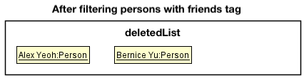
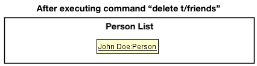
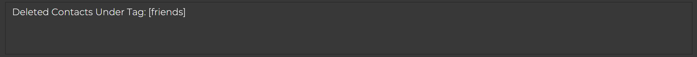
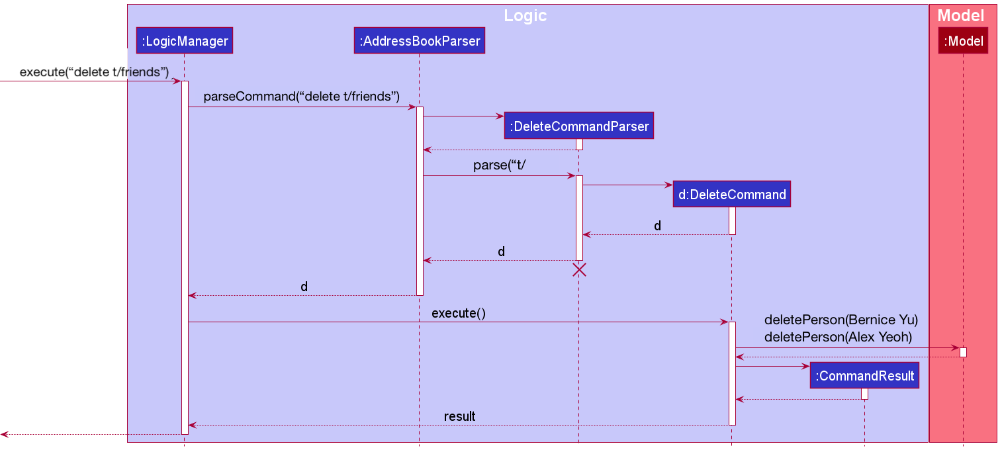
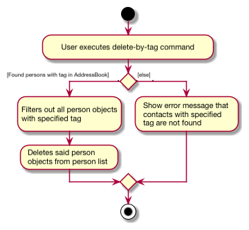
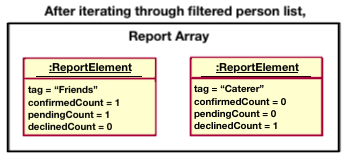
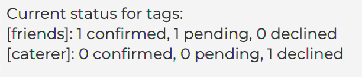
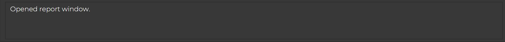

* Table of Contents
{:toc}

--------------------------------------------------------------------------------------------------------------------

## **Acknowledgements**

* {list here sources of all reused/adapted ideas, code, documentation, and third-party libraries -- include links to the original source as well}

--------------------------------------------------------------------------------------------------------------------

## **Setting up, getting started**

Refer to the guide [_Setting up and getting started_](SettingUp.md).

--------------------------------------------------------------------------------------------------------------------

## **Design**

:bulb: **Tip:** The `.puml` files used to create diagrams in this document can be found in the [diagrams](https://github.com/se-edu/addressbook-level3/tree/master/docs/diagrams/) folder. Refer to the [_PlantUML Tutorial_ at se-edu/guides](https://se-education.org/guides/tutorials/plantUml.html) to learn how to create and edit diagrams.

### Architecture

The ***Architecture Diagram*** given above explains the high-level design of the App.

Given below is a quick overview of main components and how they interact with each other.

**Main components of the architecture**

**`Main`** has two classes called [`Main`](https://github.com/se-edu/addressbook-level3/tree/master/src/main/java/seedu/address/Main.java) and [`MainApp`](https://github.com/se-edu/addressbook-level3/tree/master/src/main/java/seedu/address/MainApp.java). It is responsible for,
* At app launch: Initializes the components in the correct sequence, and connects them up with each other.
* At shut down: Shuts down the components and invokes cleanup methods where necessary.

[**`Commons`**](#common-classes) represents a collection of classes used by multiple other components.

The rest of the App consists of four components.

* [**`UI`**](#ui-component): The UI of the App.
* [**`Logic`**](#logic-component): The command executor.
* [**`Model`**](#model-component): Holds the data of the App in memory.
* [**`Storage`**](#storage-component): Reads data from, and writes data to, the hard disk.

**How the architecture components interact with each other**

The *Sequence Diagram* below shows how the components interact with each other for the scenario where the user issues the command `delete 1`.

Each of the four main components (also shown in the diagram above),

* defines its *API* in an `interface` with the same name as the Component.
* implements its functionality using a concrete `{Component Name}Manager` class (which follows the corresponding API `interface` mentioned in the previous point.

For example, the `Logic` component defines its API in the `Logic.java` interface and implements its functionality using the `LogicManager.java` class which follows the `Logic` interface. Other components interact with a given component through its interface rather than the concrete class (reason: to prevent outside component's being coupled to the implementation of a component), as illustrated in the (partial) class diagram below.

The sections below give more details of each component.

### UI component

The **API** of this component is specified in [`Ui.java`](https://github.com/se-edu/addressbook-level3/tree/master/src/main/java/seedu/address/ui/Ui.java)

The UI consists of a `MainWindow` that is made up of parts e.g.`CommandBox`, `ResultDisplay`, `PersonListPanel`, `StatusBarFooter` etc. All these, including the `MainWindow`, inherit from the abstract `UiPart` class which captures the commonalities between classes that represent parts of the visible GUI.

The `UI` component uses the JavaFx UI framework. The layout of these UI parts are defined in matching `.fxml` files that are in the `src/main/resources/view` folder. For example, the layout of the [`MainWindow`](https://github.com/se-edu/addressbook-level3/tree/master/src/main/java/seedu/address/ui/MainWindow.java) is specified in [`MainWindow.fxml`](https://github.com/se-edu/addressbook-level3/tree/master/src/main/resources/view/MainWindow.fxml)

The `UI` component,

* executes user commands using the `Logic` component.
* listens for changes to `Model` data so that the UI can be updated with the modified data.
* keeps a reference to the `Logic` component, because the `UI` relies on the `Logic` to execute commands.
* depends on some classes in the `Model` component, as it displays `Person` object residing in the `Model`.

### Logic component

**API** : [`Logic.java`](https://github.com/se-edu/addressbook-level3/tree/master/src/main/java/seedu/address/logic/Logic.java)

Here's a (partial) class diagram of the `Logic` component:

How the `Logic` component works:
1. When `Logic` is called upon to execute a command, it uses the `AddressBookParser` class to parse the user command.
1. This results in a `Command` object (more precisely, an object of one of its subclasses e.g., `AddCommand`) which is executed by the `LogicManager`.
1. The command can communicate with the `Model` when it is executed (e.g. to add a person).
1. The result of the command execution is encapsulated as a `CommandResult` object which is returned back from `Logic`.

The Sequence Diagram below illustrates the interactions within the `Logic` component for the `execute("delete 1")` API call.

:information_source: **Note:** The lifeline for `DeleteCommandParser` should end at the destroy marker (X) but due to a limitation of PlantUML, the lifeline reaches the end of diagram.

Here are the other classes in `Logic` (omitted from the class diagram above) that are used for parsing a user command:

How the parsing works:
* When called upon to parse a user command, the `AddressBookParser` class creates an `XYZCommandParser` (`XYZ` is a placeholder for the specific command name e.g., `AddCommandParser`) which uses the other classes shown above to parse the user command and create a `XYZCommand` object (e.g., `AddCommand`) which the `AddressBookParser` returns back as a `Command` object.
* All `XYZCommandParser` classes (e.g., `AddCommandParser`, `DeleteCommandParser`, ...) inherit from the `Parser` interface so that they can be treated similarly where possible e.g, during testing.

### Model component
**API** : [`Model.java`](https://github.com/se-edu/addressbook-level3/tree/master/src/main/java/seedu/address/model/Model.java)

The `Model` component,

* stores the address book data i.e., all `Person` objects (which are contained in a `UniquePersonList` object).
* stores the currently 'selected' `Person` objects (e.g., results of a search query) as a separate _filtered_ list which is exposed to outsiders as an unmodifiable `ObservableList<Person>` that can be 'observed' e.g. the UI can be bound to this list so that the UI automatically updates when the data in the list change.
* stores the countdown data i.e., a `Countdown` object.
* stores a `UserPref` object that represents the user’s preferences. This is exposed to the outside as a `ReadOnlyUserPref` objects.
* does not depend on any of the other three components (as the `Model` represents data entities of the domain, they should make sense on their own without depending on other components)

:information_source: **Note:** An alternative (arguably, a more OOP) model is given below. It has a `Tag` list in the `AddressBook`, which `Person` references. This allows `AddressBook` to only require one `Tag` object per unique tag, instead of each `Person` needing their own `Tag` objects. 

### Storage component

**API** : [`Storage.java`](https://github.com/se-edu/addressbook-level3/tree/master/src/main/java/seedu/address/storage/Storage.java)

The `Storage` component,
* can save both address book data, user preference data, countdown data, and shortcut data in json format, and read them back into corresponding objects.
* inherits from both `AddressBookStorage`, `UserPrefStorage`, `CountdownStorage`, and `ShortcutStorage` which means it can be treated as either of them (if only the functionality of only one is needed).
* can save address book data, countdown data, shortcut data, and user preference data in json format, and read them back into corresponding objects.
* depends on some classes in the `Model` component (because the `Storage` component's job is to save/retrieve objects that belong to the `Model`)

### Common classes

Classes used by multiple components are in the `seedu.addressbook.commons` package.

--------------------------------------------------------------------------------------------------------------------

## **Implementation**

This section describes some noteworthy details on how certain features are implemented.

### Find by Tag and Price feature
#### Implementation
Finding by Tag and Price is a combinatory feature implemented by `Predicates`. The predicate for tags is `TagContainsKeywordsPredicate`.

Finding by price range uses three different predicates.

1. `PriceEqualsNumberPredicate` for to find equal to price
2. `PriceGreaterThanNumberPredicate` for to find greater than certain price
3. `PriceLessThanNumberPredicate` for to find less than certain price

The 5 operators =, <, >, >=, <= are implemented using the above predicates.

| Operator | Predicate |
| ------------- | ------------- |
| =  | `PriceEqualsNumberPredicate`  |
| >  | `PriceGreaterThanNumberPredicate`  |
| <  | `PriceLessThanNumberPredicate`  |
| >=  | `PriceEqualsNumberPredicate \|\| PriceGreaterThanNumberPredicate`  |
| <=  | `PriceEqualsNumberPredicate \|\| PriceLessThanNumberPredicate`  |

The following activity diagram summarizes what happens when a user executes a find command:

#### Design considerations:
**Aspect: How each predicate is combined together:**

* **Alternative 1 (current choice):** Queried list of contacts must fit all three criterias at once.
    * Pros: It is likely user would use this feature more as it narrows the scope of the query
    * Cons: Some users may misinterpret the functionality and be confused
* **Alternative 2:** Queried list of contacts can fit any of the three criterias
    * Pros: Consistent with how multiple names work with the `find [NAMES]` function
    * Cons: Less likely to be used as additional parameters won't increase effectiveness of query.

### Shortcut features
#### Implementation
The shortcut implementation is facilitated by a Shortcut module with four commands: `sc`, `addsc`, `removesc`, and `listsc`. Each responsible for the call shortcut, add shortcut, remove shortcut, and list shortcut functions respectively. 

`Shortcut` mechanism is similar to `AddressBook` but instead stores a `HashMap<String, String>` of shortcuts corresponding to its `key` and `commandString`. To store it in JSON, `JsonShortcutStorage` use `JsonSerializableShortcut` to read and write from the JSON file. The storage architecture can be seen in the diagram above.

Given below is an example usage scenario and how the shortcut mechanisms behaves at each step.

Step 1. The user launches the applicatio nand has the following person list saved. `Shortcut` stores this in the shortcutMap.

Step 2. The user executes `sc f` to call the shortcut `f` leading to the command `find pr/>0.00` to be called. The `sc` command first calls `Model#getShortcutFromKey()` to obtain the command from the model.

Step 3. The `sc` command takes this new command and parses it in the `AddressBookParser`. If this succeeds command in the `commandString` is executed on the same model.  

Below is a simplified sequence diagram showing how a `ShortcutCommand` would interact with the logic component. The interactions of the `FindCommand` stored in the `commandString` is simpified as the main focus of this diagram is the shortcut functionality.

The following activity diagram summarizes what happens when a user executes a shortcut-keyword command:

#### Design considerations:

**Aspect: When to check if shortcut command is valid:**

* **Alternative 1 (current choice):** Check when it is called by `sc`
    * Pros: Less intensive on the system. User can still check if command is correct by eye using `listsc`
    * Cons: User needs to make sure they add the correct command themselves
* **Alternative 2:** Check when it is added by `addsc`
    * Pros: User can avoid the case where they add an invalid command
    * Cons: Bug Prone. Commands may have runtime errors depending on the state of the `AddressBook` (Unable to tell if command is invalid). 

### Delete by name feature
#### Implementation
The delete-by-name mechanism is facilitated by `AddressBook`. It implements `ReadOnlyAddressBook` with a person list, stored internally as an `persons`. Additionally, it implements the following operation:

* `AddressBook#removePerson()` — Removes specified person from its person list.

The operation is exposed in the `Model` interface as `Model#deletePerson()`.

Given below is an example usage scenario and how the delete-by-name mechanism behaves at each step.

Step 1. The user launches the application and has the following person list saved. `AddressBook` stores these contacts as `persons`.

Step 2. The user executes `delete n/John Doe` command to delete the person named *John Doe* in the list.
The `delete` command first calls `Model#updateFilteredPersonList()` and `Model#getFilteredPersonList()` to get a list where all the persons in the list named *John Doe*.

Step 3. With the access to the filtered list, it calls `Model#deletePerson()`, causing `AddressBook` to remove each person in the
list by calling `AddressBook#removePerson()`. Finally, the user will see the updated person list with *John Doe* removed.

:information_source: **Note:** If a name is not found, it will not call `Model#deletePerson()`, so the `AddressBook` person list will not be modified.

The following sequence diagram shows how the delete-by-name operation works:

:information_source: **Note:** The lifeline for `DeleteCommandParser` should end at the destroy marker (X) but due to a limitation of PlantUML, the lifeline reaches the end of diagram.

The following activity diagram summarizes what happens when a user executes a set-wedding-countdown command:

#### Design considerations:

**Aspect: How delete-by-name executes:**

* **Alternative 1 (current choice):** Deletes the person with the exact same name.
    * Pros: Avoid the situation where user deletes the wrong person
    * Cons: User needs to remember the name precisely.
* **Alternative 2:** Deletes the person who names partially contains the specified name.
    * Pros: User does not have to remember the full name (e.g. `delete n/Alex` will delete both person named *Alex Tan* and *Alex Yeoh*).
    * Cons: Might delete the wrong person.

_{more aspects and alternatives to be added}_

### Countdown to the wedding day feature
#### Implementation
The countdown mechanism is facilitated by `Countdown`. It implements `ReadOnlyCountdown` with a wedding date, stored internally as `weddingDate`. Additionally, it implements the following operation:

* `Countdown#setData()` — Replaces the existing wedding date with a new date.
* `Countdown#getDate()` — Returns an unmodifiable view of the wedding date.

The operation is exposed in the `Model` interface as `Model#setDate()` and `Model#getWeddingDate()`.

Given below is an example usage scenario and how the countdown mechanism behaves at each step.

Step 1. The user launches the application and never set wedding date before. `Countdown` automatically stores today's date as `weddingDate`. Say today is `4 November 2021`.

Step 2. The user executes `countdown 2022-05-20` command to set his/her wedding date to `20 May 2022`.
The `countdown` command then calls `Model#setDate()` to set the wedding date to `20 May 2022`.

Step 3. With this updated wedding date, the user executes `countdown` (without argument) command to see the number of 
days left until his/her wedding above the command box.

Step 4. The user can also view the countdown at the right top corner of the app immediately after updating the wedding
date.

:information_source: **Note:** If the date specified has passed, it will 
not call `Model#setDate()`, so the `Countdown` wedding date will not be modified.

The following sequence diagram shows how the set-wedding-date-for-countdown operation works:

:information_source: **Note:** The lifeline for `CountdownCommandParser` should end at the destroy marker (X) but due to a limitation of PlantUML, the lifeline reaches the end of diagram.

The following activity diagram summarizes what happens when a user executes a delete-by-name command:

#### Design considerations:

**Aspect: How setting wedding date for countdown executes:**

* **Alternative 1 (current choice):** Does not allow setting past date as wedding date.
    * Pros: Fit for the purpose of the app: planning for future wedding.
    * Cons: Cannot track how many days has passed since the wedding.
* **Alternative 2:** Allow setting past date as wedding date.
    * Pros: Can track how many days has passed since the wedding.
    * Cons: Does not fit for the purpose of the app: planning for future wedding.

_{more aspects and alternatives to be added}_

### Cost sum checking feature
#### Implementation
The cost sum checking mechanism is facilitated by `Model`. It implements the following operation:

* `Model#updateFilteredPersonList()` — Filters the person list with specified condition(s).

Given below is an example usage scenario and how the cost sum checking mechanism behaves at each step.

Step 1. The user launches the application and wants to check the total expenses for certain categories. Let say he/she
has the following contacts stored.

:information_source: **Note:** 
A contact's `status` indicates whether the user has confirmed to hire this person/ the user is sure that this person will
attend his/her wedding. Therefore, based on the diagram above, the user has **confirmed** to hire `Bernice Yu` as his/her
**florist** with the cost of **300.00 dollars**.

Step 2. The user executes `price t/Florist Photographer` command to check the expenses under `Florist` and `Photographer`
category. The `price` command first calls `Model#updateFilteredPersonList()` to get all the contacts with `confirmed`
status.

Step 3. With this filtered list, `price` command then further filters out person(s) with either `Florist` or `Photographer` 
tags. Then, it calculates the total sum of `price` for each contact(s) in this filtered list.

Step 4. Finally, the user can view the calculation result right above the command box.

Step 4. The user then checks the total cost of his/her wedding by executing `price` command (without any argument). Hence,
`price` command will just sum up all the `price` for all the contacts with `confirmed` status. The only contacts with 
`confirmed` status are `Alex Yeoh` and `Bernice Yu`, respectively hired by the user with the cost **650.00 dollars** and
**300.00 dollars**. Hence, the total is **950.00** dollars.

:information_source: **Note:** If the category(tag) specified is not found,
then the cost under that category is considered as **0.00 dollar** and will not be added to the sum.

The following sequence diagram shows how the cost-sum-checking operation works:

:information_source: **Note:** The lifeline for `PriceCommandParser` should end at the destroy marker (X) but due to a limitation of PlantUML, the lifeline reaches the end of diagram.

#### Design considerations:

**Aspect: How cost-sum-checking operation executes:**

* **Alternative 1 (current choice):** Does not calculate the cost for those who has not confirmed yet.
    * Pros: Gives an exact number on those categories the user confirms to spend money on.
    * Cons: The total sum does not include the potential expenses, i.e. cost for persons with `pending` status.
* **Alternative 2:** Calculate the cost for those who has not confirmed yet.
    * Pros: The total sum includes the potential expenses, i.e. cost for persons with `pending` status.
    * Cons: Does not give an exact number on those categories the user confirms to spend money on.

_{more aspects and alternatives to be added}_

### Delete By Tag feature

#### Implementation

The delete by tag mechanism is facilitated by `AddressBook`, which implements `ReadOnlyAddressBook`. 
Additionally, it implements the following operation:

* `AddressBook#removePerson()` — Removes specified person from `person` list in address book

This operation is exposed in the `Model` interface as `Model#deletePerson()`.

Given below is an example usage scenario and how the delete by tag mechanism behaves at each step.

Step 1. The user launches the application for the first time. The `AddressBook` will be initialized with the
`person` list consisting of all contacts (image adapted from Delete-by-name section).

Step 2. The user executes `delete t/friends` command to delete contacts consisting of the friends tag. The `delete` command first calls 
`Model#getFilteredPersonList()` and then iterates through the given list to filter out `person` objects that have the friends tag. While doing so, relevant
`person` objects are placed into a separate list known as `deletedlist`. Assuming that Alex Yeoh and Bernice Yu are the only contacts with the friends tag, 
the deletedlist is updated as follows.

Step 3. The `delete` command then fully iterates through `deletedlist`, and calls `Model#deletePerson()` at each iteration to remove 
every person identified as part of the `deletedlist` from the `AddressBook`.

Step 4. Once the contacts have been successfully deleted, a command result indicating that contacts under friends tag has been removed is reproduced in the command box.

:information_source: **Note:** If the tag is not present in the `AddressBook`, 
then the `delete` command throws an error message that specifies that contacts with such a tag do not exist in the `AddressBook`.

The following sequence diagram shows how the delete by tag operation works:

:information_source: **Note:** The lifeline for `Delete by Tag` should end at the destroy marker (X) but due to a limitation of PlantUML, the lifeline reaches the end of diagram.

The following activity diagram summarizes what happens when a user executes a new delete by tag command:

#### Design considerations:

**Aspect: How delete by tag executes:**

* **Alternative 1 (current choice):** Deletes all contacts with tag.
    * Pros: Easy to implement.
    * Cons: May be inconvenient for users who wish to delete selected range of contacts (e.g. delete pending contacts under friends).

* **Alternative 2:** Deletes selected contacts within tag.
    * Pros: Increases ease of deleting multiple contacts with different statuses for user
    * Cons: Difficult to implement, and could potentially add confusion with an increase in syntax required to 
      differentiate various functions for delete.

_{more aspects and alternatives to be added}_

### Report feature (Status)

#### Implementation

:information_source: **Note:** 
The following details on implementation only cover the information on how the status count across different tags
is computed within the report. Implementation details regarding expenditure calculations and overall contact status count are left out.

The report mechanism is facilitated by `Model`. Additionally, it implements the following operation:

* `Model#getFilteredPersonList()` — Provides`person` list in address book based on the predicate provided

Given below is an example usage scenario and how the report behaves at each step.

Step 1. The user launches the application for the first time. The `AddressBook` will be initialized with the
`person` list consisting of all contacts (image adapted from Delete-by-name section).

Step 2. The user executes `report` command to view the status (and expenditure) across all tags. The `report` command calls
`Model#getFilteredPersonList()` and then iterates through the given list to filter out tags and check the respective status count for each tag (i.e. number of confirmed, pending and declined contacts associated with each tag).
While doing so, each tag and the status count associated with it is stored within a `reportElement` which is placed and regularly updated in a separate arraylist known as `reportArray`. 
Assuming that the following is the details for the contacts stored,

* Alex Yeoh: Tag is friends and status is pending
* Bernice Yu: Tag is friends and status is confirmed
* John Doe: Tag is caterer and status is declined

the diagram below would be expected.

Step 3. The `report` command then fully iterates through the `reportArray`, and produces a text report of the different tags identified
as well as their respective status counts (in the form of a popup window).

Step 4. After that, a command result indicating that the report window is opened is reproduced in the command box.

#### Design considerations:

**Aspect: How report executes:**

* **Alternative 1 (current choice):** Produces status for tags and expenditure in a text form.
    * Pros: Easy to understand and implement the report.
    * Cons: May be inconvenient for users to read through the entire report when the number of tags and contacts is very high.

* **Alternative 2:** Produces graphical representation of report
    * Pros: Enables user to better visualise status of different tags
    * Cons: Could be difficult to interpret graph if user uses a large range of tags with various statuses.

_{more aspects and alternatives to be added}_

### Undo feature

The undo mechanism is facilitated by an Undo module and is prompted by the command `undo`. This command 
is used for undoing the most recent change made to the program. 

It uses the `ReadOnlyAddressBook` interface to retrieve the list of people stored as contacts. 
The undo mechanism invokes the following operations:

* `AddressBook#removePerson()` — Removes the specific person from the list of people.
* `AddressBook#setPerson()` — Adds the specific person to the list of people.

The above operations are represented by the Model interface in the UndoCommand class as `Model#deletePerson()` and
`Model#setPerson()` respectively.

To undo a task, the undo class keeps track of what the previous command is through the method `Undo#setPreviousCommand`,
and when the `undo` command is inputted, it checks what the previous command (static variable prevCommand)) was and 
whether it can be undone.

As of now, the `undo` command will revert the action of an `add`, `edit`, `delete`, `clear` or `group` command. Other
commands cannot be undone (due to their nature) or have not been implemented.

Given below is an example usage scenario and how the undo mechanism behaves at each step.

Step 1. The user launches the application for the first time. The AddressBook person list is shown below.

The prevCommand variable is set to nothing, as no previous command has been made.

Step 2. The user executes `edit 1 s/Confirmed` command to change the status of the first person in the book to confirmed.
The `edit` command called will invoke `Model#setPerson()` to make the changes to the AddressBook person list.

The prevCommand variable will now be assigned to this EditCommand object.

Step 3. The user executes `delete 1` to delete the first person in the group.
The `delete` command will call `Model#deletePerson()`, making a change to the AddressBook person list once again.

The prevCommand variable will now be assigned to this DeleteCommand object.

:information_source: **Note:** 
If a command is invalid, it will not call `Model#setPerson()` or 
`Model#deletePerson()`, and the prevCommand value will be set to null.

Step 4. The user now decides that deleting the person was a mistake, and decides to undo that action by executing the `undo` command. 
The `undo` command will call `Model#setPerson()`, which will revert the AddressBook person list to the 
previous state as a result of re-adding the contact at the exact same location.

The prevCommand variable is also updated to equal the UndoCommand object.

The following sequence diagram shows how the undo operation works (for undoing a delete command):

Step 5. The user then decides to execute the command `list`. Commands that do not modify the AddressBook person list
such as `list`, will just output a message stating that such a command cannot be undone.

Step 6. The user wants to use undo on the `shortcut` command, in which case the program will output that undo
has not been implemented for such a command.

:information_source: **Note:** 
If a command is valid but cannot be undone, the prevCommand value will still be
set to the command but upon evaluation the undo action will not be performed.

The following activity diagram summarizes what happens when a user tries to undo a command:

#### Design considerations:

**Aspect: How undo executes:**

* **Alternative 1 (current implementation):** Having an undo class to execute the command.
  * Pros: Easy to keep track of what the previous command is.
  * Cons: as the number of commands increase, the harder it is to keep track
     of undoing all commands in one place.
* **Alternative 2:** Individual command knows how to undo/redo by itself.
  * Pros: No need to store several commands' undoing operations in one class,
    can have one undo operation (method) for each command.
  * Cons: May be harder to keep track of what the previous command is.
* **Alternative 3:** Store various states of the AddressBook.
  * Pros: Easy to retrieve.
  * Cons: Memory issues, when to delete an old (no longer useful) state.
    
_{more aspects and alternatives to be added}_

### \[Proposed\] Data archiving

_{Explain here how the data archiving feature will be implemented}_

--------------------------------------------------------------------------------------------------------------------

## **Documentation, logging, testing, configuration, dev-ops**

* [Documentation guide](Documentation.md)
* [Testing guide](Testing.md)
* [Logging guide](Logging.md)
* [Configuration guide](Configuration.md)
* [DevOps guide](DevOps.md)

--------------------------------------------------------------------------------------------------------------------

## **Appendix: Requirements**

### Product scope

**Target user profile**:

* plans a wedding for himself/herself
* has a need to manage a significant number of contacts of who will be involving/in-charged for the wedding
* prefers desktop applications over other types
* can type fast on keyboards
* prefers typing to mouse interactions
* is reasonably comfortable and prefers using CLI applications
* is often forgetful and needs a program that will assist him with keeping track of the wedding details

**Value proposition**: manage contacts faster than a typical mouse/GUI driven app and more specific to wedding-planning

### User stories

Priorities: High (must have) - `* * *`, Medium (nice to have) - `* *`, Low (unlikely to have) - `*`

| Priority | As a …​                                    | I want to …​                                                   | So that I can…​                                                     |
| -------- | --------------------------------------------- | ----------------------------------------------------------------  | ---------------------------------------------------------------------- |
| `* * *`  | new user                                      | read usage instructions                                           | refer to instructions when I forget how to use the App                 |
| `* * *`  | user                                          | add a new person                                                  |                                                                        |
| `* * *`  | user with changing plans                      | delete a person                                                   | remove entries that I no longer need                                   |
| `* * *`  | user who wants convenience                    | find a person by name                                             | save time by not searching through the entire contact list             |
| `* * *`  | private user                                  | hide private contact details                                      | minimize chance of someone else seeing them by accident                |
| `* * *`  | user with several contacts                    | filter contacts                                                   | keep track of them                                                     |
| `* * *`  | careless user                                 | undo the last incorrect change made to tasks                      | revert my mistake                                                      |
| `* * *`  | expert user                                   | use shortcuts to access different features                        | utilise the app efficiently                                            |
| `* * *`  | frugal user                                   | add price tags to contacts                                        | avoid exceeding my budget                                              |
| `* * *`  | forgetful user                                | notified for a specific time to remind myself to complete a task  | avoid forgetting to complete any important tasks                       |
| `* * *`  | user with poor time management skills         | keep track of payment and deadlines                               | avoid missing any payments and getting fined                          |
| `* * *`  | very organized user                           | group contacts under the same category                            | manipulate the contacts easily                                         |
| `* * *`  | user who wants to customise the program       | create shortcuts for longer commands                              | use the commands more efficiently                                      |
| `* * *`  | infrequent user                               | get reminded via email of when to handle contacts                 | avoid not being aware of my plans                                      |
| `* *  `  | user who relies on faces for for recognition  | view the profile picture of contacts whose faces I have forgotten | recognise these people should I have to meet them in the future        |
| `* *  `  | user with limited time to find contacts       | access recommended contacts                                       | prioritise adding more important contacts from scratch                 |
| `* *  `  | user who needs to prioritise certain contacts | rank the contacts                                                 | see who needs to be called more often                                  |
| `* *  `  | busy user                                     | schedule different timings for different contacts                 | plan the wedding around my schedule                                    |
| `* *  `  | user who invites a lot of people              | check the attending status of guests                              | my plan is consistent                                                  |

*{More to be added}*

### Use cases

(For all use cases below, the **System** is the `WedFast` and the **Actor** is the `user`, unless specified otherwise)

**Use case: Add multiple contacts to a group**

**Guarantees**
* Contacts will be added to a group only if both the contacts and group exist.

**MSS**

1. User types out names of the contacts with group name using specified format.
2. User confirms.
3. System adds contact to said group. 
    Use case ends.

**Extensions**
* 2a. Either one of the names/group name is unspecified/blank(white spaces only)/does not exist.
    * 2a1. System shows an error message. 
    Use case resumes at step 1.

**Use case: Add/Edit price tag**

**Guarantees:**
* A price tag will be added to the contact only if the contact exists and price is specified in the correct format.

**MSS**

1. When adding/editing contact, user also types in the price detail.
2. User confirms.
3. System updates the contact list and the target contact will now have price tag(s). 
    Use case ends.

**Extensions**
* 2a. Price is unspecified/blank(white spaces only)/written in invalid format.
    * 2a1. System shows an error message. 
      Use case resumes at step 1.

**Use case: Executes a shortcut**

**Guarantees:**
* Shortcut will only be executed if shortcut exists and command is valid.

**MSS**

1. User calls a shortcut
2. Command String attached to the shortcut keyword is called
3. System runs the command attached at the user story of that command will run  
Use case ends.

**Extensions**
* 1a. Shortcut keyword used does not exist
    * 1a1. System shows an error message.
      Use case resumes at step 1.
* 3a. Shortcut command string is an invalid command
    * 3a1. System shows an error message.
      Use case resumes at step 1.
* 3b. Running the command result in error
    * 3b1. System shows the error message of the command
      Use case resumes at step 1.
*{More to be added}*

### Non-Functional Requirements

1.  Should work on any pc as long as it has Java `11` or above installed.
2.  Should be able to store and manage at least 100 contacts.
3.  Should be able to guarantee data security to protect privacy of user.
4.  Should not store more than 20 MB of information.
5.  Program should respond within 2 seconds of each command.
6.  Product is not handling more than 1 user planning a wedding at once.
7.  Should be usable by anyone who understands english without any experience in planning weddings.

### Glossary

* **Mainstream OS**: Windows, Linux, Unix, OS-X
* **PlantUML**: is a tool for specifying various diagrams in a textual form.
* **API**: The Application Programming Interface specifies the interface through which software and other programs interact
* **Private contact detail**: A contact detail that is not meant to be shared with others
* **Filter**: Add tags to contacts such as price, type of contact
* **Actor**: a role played by a use case
* **Keyword**: Keyword used to call a shortcut
* **Command String**: Command attached to the keyword of the shortcut

--------------------------------------------------------------------------------------------------------------------

## **Appendix: Instructions for manual testing**

Given below are instructions to test the app manually.

:information_source: **Note:** These instructions only provide a starting point for testers to work on;
testers are expected to do more *exploratory* testing.

### Launch and shutdown

1. **Initial launch**

   1. Download the jar file and copy into an empty folder

   1. Double-click the jar file Expected: Shows the GUI with a set of sample contacts. The window size may not be optimum.

1. **Saving window preferences**

   1. Resize the window to an optimum size. Move the window to a different location. Close the window.

   1. Re-launch the app by double-clicking the jar file. 
       Expected: The most recent window size and location is retained.

### Deleting a person

1. **Deleting a person while all persons are being shown**

   1.1. Prerequisites:
      * List all persons using the `list` command. Multiple persons in the list.
      * Add a person using the command: `add n/Bryan Tan p/99778866 e/bryantan@hmail.com a/Fake Street`.
      * Make sure there is **no** person named `DUMMY CONTACT FOR TESTING` in the list.

   1.2. Test case: `delete 1` 
      Expected: First contact is deleted from the list. Details of the deleted contact shown in the status message. Timestamp in the status bar is updated.

   1.3. Test case: `delete 0` 
      Expected: No person is deleted. Error details shown in the status message. Status bar remains the same.
   
   1.4. Test case: `delete n/Bryan Tan` 
      Expected: The contact `Bryan Tan` is deleted from the list. Details of the deleted contact shown in the status message. Timestamp in the status bar is updated.
   
   1.5. Test case: `delete n/DUMMY CONTACT FOR TESTING` 
      Expected: No person is deleted. Error details shown in the status message. Status bar remains the same.

   1.6. Other incorrect delete commands to try: `delete`, `delete n/`, `delete n/   `, `delete x` (where x is larger than the list size) 
      Expected: Similar to previous.

### Counting down to the wedding day

1. **Set the date of the wedding**

   1.1. Test case: `countdown 2025-04-29` 
        Expected: The wedding date has been set to `2025-04-29`. The wedding date shown in the status message along with the countdown. Timestamp in the status bar is updated.

   1.2. Test case: `countdown 29-04-2025` 
        Expected: No wedding date is set. Error details shown in the status message. Status bar remains the same.

   1.3. Other incorrect set-wedding-countdown command to try: `countdown 2025 April 29`, `countdown somedummytexthere` 
        Expected: Similar to previous.

### Checking expenses of the wedding

1. **Checking total cost of the wedding**

   1.1. Test case: `price` 
        Expected: The total cost of the wedding shown in the status message. Timestamp in the status bar is updated.

   1.2. Test case: `price somedummytexthere` 
        Expected: Error details shown in the status message. Status bar remains the same.

2. **Checking total cost for a particular group(tag)**

   1.1. Prerequisites: 
      * Learn how to use `edit` command to edit the contact, refer [here](https://ay2122s1-cs2103t-w10-4.github.io/tp/UserGuide.html#editing-a-person--edit).
      * Modify the contact list using `edit` command such that the first and second contact has the following details:
        * tags: `item1` 
        * price: `$100.00`
        * status: `Confirmed`
      * Then, modify the rest of the contacts using `edit` command so that all of them have either `Pending` or `Declined`
        status.
      * Make sure the first and second contact in the list **do not** have the tag `SOMERANDOMTAGHERE`

   1.2. Test case: `price t/item1` 
       Expected: The total cost of for the group(tag) `item` shown in the status message. Timestamp in the status bar is updated.

   1.3. Test case: `price t/SOMERANDOMTAGHERE` 
        Expected:  Error details shown in the status message. Status bar remains the same.

   1.4. Other incorrect cost-sum-checking command to try: `price t/` 
        Expected: Similar to previous.

### Deleting a tag

1. Deleting persons with a specific tag

    1. Test case: `delete t/testTag` 
       Expected: All contacts with tag, "testTag" are deleted from the list. A success command message stating that contacts under said tag has been removed is shown in the command box.

    1. Test case: `delete t/unknownTag` 
       Expected: Assuming that person with, "unknownTag" does not exist in the list. Error message stating contacts with such a tag cannot be found is shown in the command box. 

    1. Incorrect delete by tag commands to try: `delete t/`  
       Expected: Error message stating that tag specified must be a non-empty and non-blank string is provided in the command box.

### Report

1. Showing report consisting of a summary of the statuses and expenses across different tags.

    1. Test case: `report` 
       Expected: Report is generated in a pop up window. A success command message indicating report window is opened is provided.

    1. Test case: `report now` 
       Expected: As long as the first word in the command starts with,"report", additional words and spaces after the command are ignored.
       The report is generated in a pop up window. A success command message indicating report window is opened is provided.

    1. Incorrect report command to try: `1 report`,`reports`  
       Expected: Since both the above commands are invalid, an error message stating unknown message is shown in the command box.

### Undoing information

1. **Undoing the previous command**    

   1.1 Test case: `help` input followed by `undo` 
       Expected: outputs to the display section of the program indicating that such a command cannot be undone because
       it has not changed the contact list information.
   
   1.2 Test case: `addsc random c/delete 1` input followed by `undo` 
       Expected: outputs a message stating that undo has not been implemented for this feature. Contact list
       remains the same.
   
   1.3 Test case: passes in a null object to the previous command before inputting `undo` (this mimicks what happens when an invalid
       input is used). 
       Expected: prints in the program that the previous command was invalid, hence undo does not work. 
   
   1.4 Test case: `delete 1` input followed by `undo` 
       Expected: deleting the first person in the list has been undone with a message indicating the task was successful. 
       Surrounded by a try-catch for the case that the contact list is empty

### Shortcut features

1. **Add a new shortcut**

   1.1. Test case: `addsc s c/list` 
        Expected: `listsc` now shows `KEY s - COMMAND list`. Calling `sc s` will list out all the contacts 

   1.2. Test case: `addsc c/list` 
        Expected: Error message. Invalid command format. 

   1.3. Other incorrect add-shortcut command to try: `addsc s` 
        Expected: Same as 1.2

2. **Using a shortcut**

   2.1. Prerequisites: 
      * Add a shortcut using `addsc` command such as the one above (keyword: `s`, command: `list`)
      * Make sure the shortcut is shown in `listsc`

   2.2. Test case: `sc s`  
   Expected: Lists out all items the exact same as the `list` command. Otherwise, functions as specified by the command string.

   2.3. Test case: `sc`  
   Expected: Incorrect format. Invalid command format error shown.

   2.4. Calling command that does not exist: `sc a`  
   Expected: Command not found eror shown

3. **Deleting a shortcut**

    3.1. Prerequisites: 
      * Add a shortcut using `addsc` command such as the one above (keyword: `s`, command: `list`)
      * Make sure the shortcut is shown in `listsc`

    3.2. Test case: `removesc s`  
    Expected: Displays message that shortcut was removed successfully. `listsc` will no longer show that contact

    3.3. Test case: `removesc`  
    Expected: Incorrect format. Invalid command format error shown.

    3.4. Calling command that does not exist: `removesc a`  
    Expected: Command not found eror shown

4. **Viewing shortcuts**

    4.1. Prerequisites: 
      * Add a shortcut using `addsc` command such as the one above (keyword: `s`, command: `list`)
    
    4.2. Test case: `listsc`  
    Expected: Displays all correct shortcuts added by the user. 

### Finding Contacts

1. **Finding contacts from their names, tags, and price**

   1.1. Prerequisites:
      * List all persons using the `list` command. Multiple persons in the list.
      * Add a person using the command: `add n/Bryan Tan p/99778866 e/bryantan@hmail.com a/Fake Street t/Tag pr/20.00`.
      * Add a person using the command: `add n/Sam p/99887766 e/samn@hmail.com a/Fake Street t/Tag Tag2 pr/10.00`.
      * Make sure there is **no** person named `DUMMY CONTACT FOR TESTING` in the list.

   1.2. Test case: `find Bryan` 
      Expected: Bryan Tan and other existing contacts named Bryan is shown. 

   1.3. Test case: `find t/Tag` 
      Expected: Both Bryan and Sam is shown as they both have the tag "Tag". 
   
   1.4. Test case: `find Bryan Sam` 
      Expected: Both Bryan and Sam is shown by searching for their names
   
   1.5. Test case: `find pr/=10.00` 
      Expected: Only Sam is shown as his price is 10.00.

   1.6. Test case: `find pr/>10.00` 
      Expected: Only Bryan is shown as his price is 20.00.

   1.7. Test case: `find pr/<20.00` 
      Expected: Only Sam is shown as his price is 10.00.
   
   1.8. Test case: `find pr/<=20.00` 
      Expected: Both Bryan and Sam is shown as their prices are lower than or equal to 20.00.
    
   1.9. Test case: `find pr/>=10.00` 
      Expected: Both Bryan and Sam is shown as their prices are higher than or equal to 10.00.
   
   1.10. Test case for invalid find: `find`, `find t/`  
      Expected: Error message shown. Invalid command format. 
    
   1.11. Test case for invalid price: `find pr/1`, `find pr/=a`  
      Expected: Error message shown. Invalid price format. 

### Saving data

1. **Dealing with missing/corrupted data files**

   1. Simulating a corrupted file:
      * In the app's home folder, look for a folder named `data`, double click into it, then look for a file named `countdown.json`.
      * If the file is not found, launches your app and type the command: `countdown`.
      * Open the file and modify the `month` to `TEST` of the countdown as shown below, then save it:
        
      * If your app is open now, close it.
   
   2. Expected behavior: 
      * Relaunches the app and you will see the following displayed in the status message. It means the original corrupted `countdown.json` will be replaced 
        with the new one the next time `countdown` command is used. Timestamp in the status bar is updated.
        
      * Use `countdown` command, then reopen the `countdown.json`. You will see the `month` has been changed to today's month.

--------------------------------------------------------------------------------------------------------------------

## **Effort**

1. **Difficulty level:** 
   * This project has the medium high level of difficulty as all of our developers has to handle this project in the time
     of pandemic. It means that all of us have to work from home, thus making the communication harder and reduce the
     productivity.
   * Furthermore, all of us has no prior experience of handling brown field project, and has very little experience in 
     using JavaFX. Most of the tools used are learnt on the spot and apply directly to the project.
   * Last but not least, this project has a very tight time constraint.

2. **Challenges faced:** 
   * Difficulty in communication: All discussions are through Zoom(a software used for online meeting) comes with the risk of slow internet connection and issue in microphone.
   * Responsibilities outside the project: Most of us has other responsibilities to deal with, limiting us from dedicating more time for this project.

3. **Effort required:** 
   * Coordinating with all the developers' schedule.
   * Learn the convention of writing a proper documentation.
   * Learn the tools such as JavaFX from scratch and apply directly.

4. **Achievements of the project:** 
   * All the deliverables for each milestone has been submitted on time.
   * All the bug detected has been solved on time.

5. Ultimately, this project has been quite challenging as our solution architecture involves the contacts with more entities type than the original AB3 project.
   The additional entities involved includes `price`, `important info`, and `status`. These serves as the foundation for some features implemented and
   requires extra time and effort to modify the existing feature to ensure the app functions as expected.

