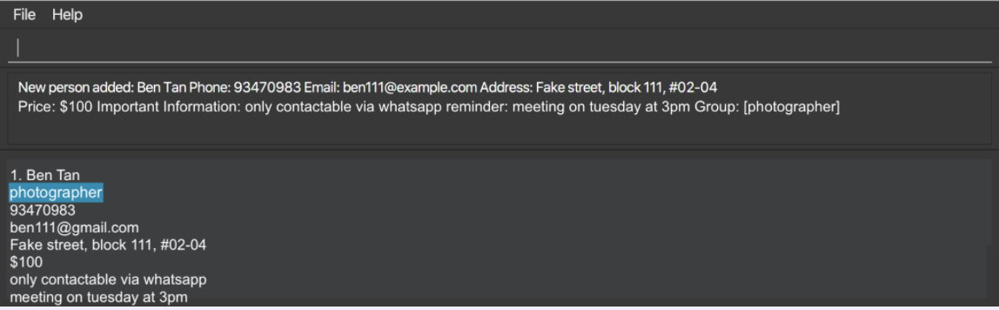
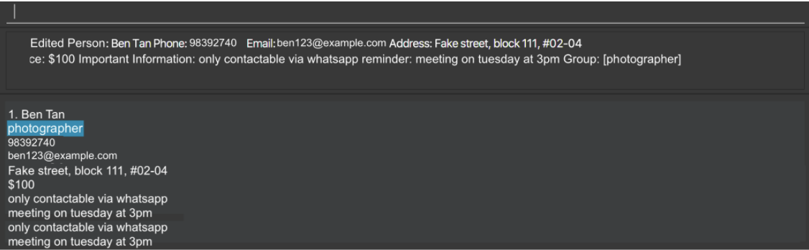

_WedFast_ is a **desktop app for managing human resources and important contacts of 
your dream wedding, optimized for use via a Command Line Interface**(CLI) while still having the benefits of a Graphical 
User Interface (GUI). If you are as busy as a beaver and prefer typing to mouse interaction, then _WedFast_ will be your
NO.1 choice to get your contact management tasks done **faster** than traditional GUI apps!

We welcome you to have a look at this user guide be a master on using _WedFast_!

---

## Table of Contents

  
About this user guide

  * [Who is this user guide for?](#who-is-this-user-guide-for)
  * [What is this user guide for?](#what-is-this-user-guide-for)

  
How to use this guide?

  
  * [Assumption on the reader](#assumption-on-the-reader)
  * [Navigation of this user guide](#navigation-of-this-user-guide)
  * [Formatting convention](#formatting-convention)
  * [Icons used](#icons-used)
  * [Terminology](#terminology)

  
Quickstart

  * [Operating system](#operating-system) 
  * [Setup requirement](#setup-requirement)
  * [Installing and launching _WedFast_](#installing-and-launching-_wedfast_)
  * [Basics](#Basics)
  * [Using Command Line Interface(CLI)](#using-command-line-interface-cli)

  
Feature: Manipulating persons in your contact list

  * [Adding a person : `add`](#adding-a-person--add)
  * [Clearing all entries : `clear`](#clearing-all-entries--clear)
  * [Deleting a person : `delete`](#deleting-a-person--delete)
  * [Editing a person : `edit`](#editing-a-person--edit)
  * [Grouping persons : `group`](#grouping-persons--group)
  * [Listing all persons : `list`](#listing-all-persons--list)
  * [Locating persons : `find`](#locating-persons--find)

  
Feature: Checking useful info of your wedding

  
  * [Counting down : `countdown`](#counting-down--countdown)
  * [Listing tag info : `tagInfo`](#listing-tag-info--taginfo)

  
Feature: Boosting your productivity

  * [Adding customizable shortcuts : `shortcut`](#adding-customizable-shortcuts--shortcut)
  * [Exiting the program : `exit`](#exiting-the-program--exit)
  * [Reminding via email : `remind`](#reminding-via-email--remind-coming-soon) (Coming soon)
  * [Undoing last change : `undo`](#undoing-last-change--undo)
  * [Redoing last change : `redo`](#redoing-last-change--redo-coming-soon) (Coming soon)
  * [Viewing help : `help`](#viewing-help--help)

  
FAQ

  * [FAQ : About the program](#faq--about-the-program)
  * [FAQ : About the command](#faq--about-the-command)

  
Command Summary

  * [Command Summary : Manipulating persons in your contact list](#command-summary--manipulating-persons-in-your-contact-list)
  * [Command Summary : Checking useful info of your wedding](#command-summary--checking-useful-info-of-your-wedding)
  * [Command Summary : Boosting your productivity](#command-summary--boosting-your-productivity)

  
Helpful information

  * [Product spec](#product-spec)
  * [Glossary](#glossary)

---

## About this User Guide
### Who is this user guide for?
* Any user who is interested in using _WedFast_ for human resources and contact management tasks of his/her wedding.
* Any novice _WedFast_ user without any prior knowledge about this app

### What is this user guide for?
* Walks you through [all the latest features](#feature-manipulating-persons-in-your-contact-list) of 
  _WedFast_. You can expect to use any feature after reading its corresponding feature section.

* Provides you a detailed and complete set of answers for [frequently asked questions](#faq). 

* Provides you with the [command cheatsheet](#command-summary) which you can refer to in case you forgot some 
[commands](/docs/UserGuide.md#Glossary) syntax format

---

## How to use this user guide?
### Assumption on the reader
* Have at least primary level of English level proficiency, i.e. can read and understand texts written in English.
* Have zero knowledge on how to use _WedFast_ but know the basics on how to use a computer.

### Navigation of this user guide
* You can use your mouse to scroll up or down to read different parts of this user guide.
* Alternatively, you can press Up or Down button to achieve the same purpose. 
* You can scroll to the top to [Table of Contents](#table-of-contents) and click on any desired section (prefix by 
  right-arrow icon) to expand the list of content. Then, click on the any item from the list to jump to that content.
* Otherwise, you can press CTRL + F and type in some keywords. Then, press Enter to navigate to each keyword found in
  this user guide.

### Formatting convention
* The name of this app: _WedFast_, is written in Italic throughout the user guide.
* Text in code block, can either mean the `command syntax` or `item of interest`.
* Both main heading and subheading are colored 
  in Orange.
* Main heading is bigger than 
  subheading.

### Icons used
* :arrow_forward: Click on this icon to expand out a list.
* :arrow_down_small: Click on this icon to hide the list.
* :information_source: A section with this icon means this section contains important information that you need to 
                       take note of
### Terminology
* _WedFast_: The name of this app.
* Table of Contents: A by-section summary of the content in this user guide.
* Quick start: A simple and quick tutorial on how to set up, install, launch, and using _WedFast_.
* Feature: _WedFast's_ function that meet your needs in human resources and contact management tasks.
* FAQ: Frequently-asked questions
* Command summary: A list of command syntax you can use to run certain feature.

---

## Quick start
### Operating system
Ensure your device runs on either **Windows** or **macOS** because _WedFast_ only supports these two
operating systems.

### Setup requirement
Ensure you have Java `11` or above installed in your device.

### Installing and launching _WedFast_
1. Download the latest `wedfast.jar` from [here](https://github.com/AY2122S1-CS2103T-W10-4/tp).

2. Copy the file to the folder you want to use as the _home folder_ for your _WedFast_.

3. Double-click the file to start the app. The GUI similar to the below should appear in a few seconds.
   Note how the app contains some sample data.
   * `INSERT PRODUCT INITIAL STATE SCREENSHORT HERE`

### Basics

**:information_source: Notes about the command format:** 

* Words in `UPPER_CASE` are the parameters to be supplied by the user. 
  e.g. in `add n/NAME`, `NAME` is a parameter which can be used as `add n/John Doe`.

* Items in square brackets are optional. 
  e.g. `n/NAME [t/TAG]` can be used as `n/John Doe t/friend` or as `n/John Doe`.

* Items with `…`​ after them can be used multiple times including zero times. 
  e.g. `[t/TAG]…​` can be used as ` ` (i.e. 0 times), `t/friend`, `t/friend t/family` etc.

* Parameters can be in any order. 
  e.g. if the command specifies `n/NAME p/PHONE_NUMBER`, `p/PHONE_NUMBER n/NAME` is also acceptable.

* If a parameter is expected only once in the command, but you specified it multiple times, only the last occurrence of the parameter will be taken. 
  e.g. if you specify `p/12341234 p/56785678`, only `p/56785678` will be taken.

* Extraneous parameters for commands that do not take in parameters (such as `help`, `list`, `exit` and `clear`) will be ignored. 
  e.g. if the command specifies `help 123`, it will be interpreted as `help`.

### Using Command Line Interface (CLI)
1. Type the command in the command box and press Enter to execute it. e.g. typing `help` and pressing Enter will open 
   the help window.
   Some example commands you can try:
   * `list` : Lists all contacts.

   * `add n/John Doe p/98765432 e/johnd@example.com a/John street, block 123, #01-01`: Adds a contact named `John Doe` to the Address Book.

   * `delete 3` : Deletes the 3rd contact shown in the current list.

   * `clear` : Deletes all contacts.

   * `exit` : Exits the app.

2. You can refer to the followings to learn more about _WedFast's_ features.
   * [Manipulating persons in your contact list](#feature-manipulating-persons-in-your-contact-list)
   * [Checking useful info of your wedding](#feature-checking-useful-info-of-your-wedding)
   * [Boosting your productivity](#feature-boosting-your-productivity)
---

## Feature: Manipulating persons in your contact list
### Adding a person : `add`
Adds a person to the _WedFast_ contact list.

Format: `add n/NAME p/PHONE_NUMBER e/EMAIL a/ADDRESS [pr/PRICE] [i/IMPORTANT_INFORMATION] [r/REMINDER] [g/group] [t/TAG]…​`

Examples:
* `add n/Ben Tan p/93470983 e/ben111@gmail.com a/Fake street, block 111, #02-04 pr/$100 i/only contactable via whatsapp r/meeting on tuesday at 3pm g/photographer`
  

### Clearing all entries : `clear`
Clears all entries from the _WedFast's_ contact list.

Format: `clear`

### Deleting a person : `delete`
Deletes the specified person from _WedFast_, either via index or name.

Format: `delete INDEX` or `delete NAME`

* `delete INDEX`: Deletes the person at the specified `INDEX`.
  The index is a positive number corresponding to the number of the person in the list.
* `delete NAME`: Deletes the person with the specified `NAME`.

Examples:
* `delete 2` deletes the 2nd person in the address book.
* `delete John Doe` deletes all the John Doe’s in the list
* `find NAME` followed by delete 2 deletes the 2nd person whose name matches the name being searched, if they exist.
  Otherwise, a message is shown stating that the index is not valid.

### Editing a person : `edit`
Edits an existing person in the _WedFast_ contact list.

Format: `edit INDEX [n/NAME] [p/PHONE] [e/EMAIL] [a/ADDRESS] [pr/PRICE] [i/IMPORTANT_INFORMATION] [r/REMINDER] [g/group] [t/tag]…​`

* Edits the person at the specified `INDEX`. The index refers to the index number shown in the displayed person list. The index **must be a positive integer** 1, 2, 3, …​
* At least one of the optional fields must be provided.
* Existing values will be updated to the input values.
* When editing tags, the existing tags of the person will be removed i.e. adding of tags is not cumulative.
* You can remove all the person’s tags by typing `t/` without
  specifying any tags after it.

Examples:
* `edit 1 p/98392740 e/ben123@example.com` Edits the phone number and email address of the 1st person to be `98392740` and `ben123@example.com` respectively.
* `edit 2 n/William Tan t/` Edits the name of the 2nd person to be `William Tan` and clears all existing tags.
   

### Grouping persons : `group`
Groups existing contacts together to an existing named group or create a new group

Format: `group [c/CONTACT] [g/GROUP_NAME]`

Add the specific CONTACT to the specific group with the name GROUP_NAME

Examples
* `group c/Alex Yoeh g/Team4`
* The contact `Alex Yoeh` will now be grouped to Team4

### Listing all persons : `list`
Lists the existing contacts based on the group.
If the group name is unspecified, then list all the existing contacts.

Format: `list`

### Locating persons : `find`
Finds persons whose names contain any of the given keywords.

Format: `find KEYWORD [MORE_KEYWORDS]`

* The search is case-insensitive. e.g. `hans` will match `Hans`
* The order of the keywords does not matter. e.g. `Hans Bo` will match `Bo Hans`
* Only the name is searched.
* Only full words will be matched e.g. `Han` will not match `Hans`
* Persons matching at least one keyword will be returned (i.e. `OR` search).
  e.g. `Hans Bo` will return `Hans Gruber`, `Bo Yang`

Examples:
* `find John` returns `john` and `John Doe`
* `find alex david` returns `Alex Yeoh`, `David Li` 
  

---

## Feature: Checking useful info of your wedding
### Counting down : `countdown`

### Listing tag info : `tagInfo`
Returns a unique list of tags with the number of contacts labelled with the tag.

Format: `tagInfo [t/TAG]...` or `tagInfo list`

Filter through the contacts with tags TAG to obtain a list of TAGs with details of how many contacts labelled by them.
The list can be specified to only limited tags or to include all the tags used to label the contacts.

Examples:
* `tagInfo t/male, colleagues` tag Info: males used by 3 people, colleagues used by 5 people
* `tagInfo list` returns a list with all the tags labelled by the contacts.

---

## Feature: Boosting your productivity
### Adding customizable shortcuts : `shortcut`
Add a shortcut bound to the SHORTCUT button

Format: `shortcut SHORTCUT [c/COMMAND]`

* SHORTCUT is a set of values of 10 buttons [q, w, e, r, a, s, d, z, x, c]

Examples:
* `shortcut q c/find Food`
* `shortcut w c/order b/price`

### Exiting the program : `exit`
Exits the program.

Format: `exit`

### Reminding via email : `remind` (Coming soon)
Sends an email reminder to the user

Format: ` remind [e/EMAIL](optional)`

* Toggles daily reminder on or off if EMAIL is empty.
* Set remind to be true if EMAIL isn't empty and set the email reminders are sent to.

Examples:
* `remind` toggle reminder
* `remind e/bob@gmail.com`

### Undoing last change : `undo`
Undoes the last edit that was made to the program.

Format: `undo`

### Redoing last change : `redo` (Coming soon)

### Viewing help : `help`
Shows a message explaining how to access the help page.

Format: `help`

---

## FAQ
### FAQ : About the program
**Q**: How do I transfer my data to another Computer? 
**A**: Install the app in the other computer and overwrite the empty data file it creates with the file that contains 
       the data of your previous _WedFast_ home folder.

### FAQ : About the command

---
## Command summary
### Command Summary : Manipulating persons in your contact list
### Command Summary : Checking useful info of your wedding
### Command Summary : Boosting your productivity

Action | Format, Examples
--------|------------------
**Add** | `add n/NAME p/PHONE_NUMBER e/EMAIL a/ADDRESS [t/TAG]…​`   e.g., `add n/James Ho p/22224444 e/jamesho@example.com a/123, Clementi Rd, 1234665 t/friend t/colleague`
**Clear** | `clear`
**Delete** | `delete INDEX`  e.g., `delete 3`
**Edit** | `edit INDEX [n/NAME] [p/PHONE_NUMBER] [e/EMAIL] [a/ADDRESS] [t/TAG]…​`  e.g.,`edit 2 n/James Lee e/jameslee@example.com`
**Find** | `find KEYWORD [MORE_KEYWORDS]`  e.g., `find James Jake`
**List** | `list`
**Help** | `help`
**Group** | `group [c/CONTACT] [g/GROUP_NAME]`   E.g., `group c/Alex Yoeh g/Team4`
**Track** | `track`
**Price Tag** | `[pr/DOLLARS.CENTS]`   E.g., `add n/Sergio Marquina p/98777777 e/professor@moneyheist.com a/Salva Wall, block 999, #09-99 pr/500.00`
**Filter** | `filter [g/GROUP_NAME] [t/TAG]...`   E.g., `filter g/Team4 t/male`
**Undo** | `undo`
**Shortcut** | `shortcut`  e.g. `shortcut q c/find Food`
**Reminder** | `remind`   eg. `remind e/bob@gmail.com`

---

## Useful information
### Product spec
### Glossary
* Command - Text input to execute/run _WedFast's_ feature
* Command Line Interface - A feature that allows the user to write command to be executed
