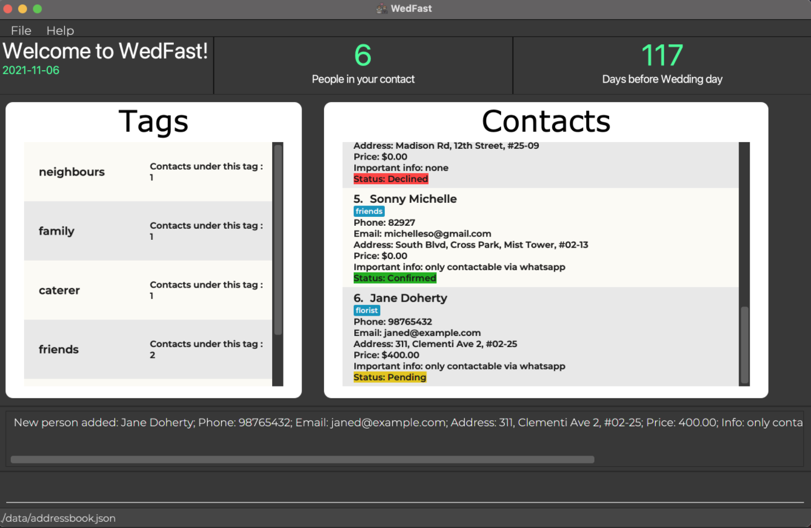
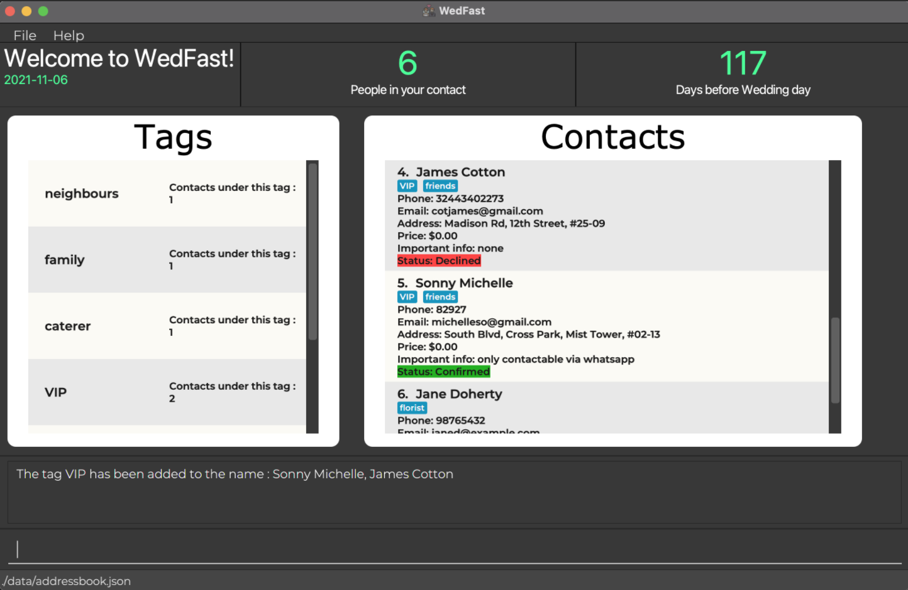
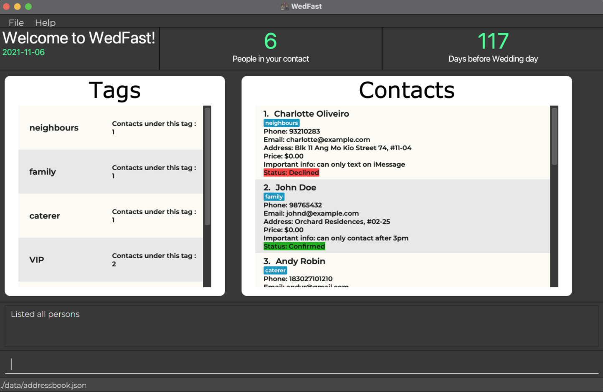
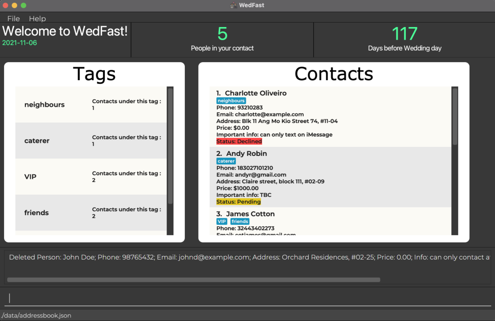
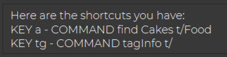

    

---

## **Table of Contents**

* [**Product Overview**](#product-overview)
* [**About This User Guide**](#about-this-user-guide)
  * [How to navigate this guide?](#how-to-navigate-this-guide)
  * [What do these icons mean?](#what-do-these-icons-mean)
  * [What do these formats mean?](#what-do-these-formats-mean)
* [**Getting Started**](#getting-started)
  * [Installation](#installation)
  * [Using command-line interface(CLI)](#using-command-line-interface-cli)
* [**Features**](#features)
  * [Viewing help : `help`](#viewing-help--help)
  * [Adding a person : `add`](#adding-a-person--add)
  * [Listing all persons : `list`](#listing-all-persons--list)
  * [Editing a person : `edit`](#editing-a-person--edit)
  * [Grouping persons : `group`](#grouping-persons--group)
  * [Locating persons : `find`](#locating-persons--find)
  * [Deleting a person : `delete`](#deleting-a-person--delete)
  * [Clearing all entries : `clear`](#clearing-all-entries--clear)
  * [Undoing last change : `undo`](#undoing-last-change--undo)
  * [Counting down to the wedding day : `countdown`](#counting-down-to-the-wedding-day--countdown)
  * [Counting head by tag : `tagInfo`](#counting-head-by-tag--taginfo)
  * [Calculating wedding cost : `price`](#calculating-wedding-cost--price)
  * [Getting your wedding plan report : `report`](#getting-your-wedding-plan-report--report)
  * [Adding customizable shortcuts : `addsc`](#adding-customizable-shortcuts--addsc)
  * [Using shortcuts : `sc`](#using--shortcuts--sc)
  * [Viewing shortcuts : `listsc`](#viewing-shortcuts--listsc)
  * [Deleting shortcuts : `removesc`](#deleting-shortcuts--removesc)
  * [Exiting the program : `exit`](#exiting-the-program--exit)
  * [Saving the data file](#saving-the-data-file)
  * [Editing the data file](#editing-the-data-file)
  * [Ungrouping persons: `ungroup`](#ungrouping-persons--ungroup-coming-soon) (Coming soon)
  * [Redoing last change : `redo`](#redoing-last-change--redo-coming-soon) (Coming soon)
  * [Reminding via email : `remind`](#reminding-via-email--remind-coming-soon) (Coming soon)
* [**FAQ**](#faq)
  * [About the program](#about-the-program)
  * [About the command](#about-the-command)
* [**Command Summary**](#command-summary)
* [**Glossary**](#glossary)

---

## **Product Overview**

**_WedFast_ is a desktop app for managing contacts of your dream wedding, optimized for use via a
[Command Line Interface](#command-line-interface-cli) (CLI) while still having the benefits of a
[Graphical User Interface](#graphical-user-interface-gui) (GUI).**

You can use _WedFast_ to **add, edit and delete contacts**. Contacts you include need not be limited to guests who are attending
your wedding. They can also consist of people you are hiring such as your photographer, caterer and costume designer. On this basis, to better 
facilitate the management of various contacts, _WedFast_ allows you to **add tags to contacts, calculate the cost, and even generate a detailed report for
your wedding plan!**

Excited to try _WedFast_ out? This user guide will **walk you through all the latest features, troubleshoot your
problems and provide you with a command summary to boost your efficiency!**

---

## **About This User Guide**

**:information_source: Welcome to _WedFast_ user guide!
In this section, you will learn how to use this guide.**

### How to navigate this guide?
1. **Navigating up or down** this user guide via either of the following methods:
  * Scroll up or down using your mouse wheel.
  * Press ↑ or ↓ button on your keyboard.

2. **Jumping to a different section** of this user guide:
  * Click on any content you want to read in the [Table of Contents](#table-of-contents).

3. **Finding keywords** in this user guide:
  * Press CTRL + F and type in some keywords.
  * Press Enter to navigate to each keyword found in this user guide.

### What do these icons mean?

**Icon**              | **Meaning**
:---------------------|:-----------------------------
:information_source:  | Important info that you need to take note of
:bulb:                | Useful tips that you might want to know
:exclamation:         | Be cautious when attempting/Things that you should avoid
🔝                    | Back to [Table of Content](#table-of-contents)

### What do these formats mean?

**Format**           | **Meaning**
:--------------------|:-----------------------------
_Italic text_        | The name of this product or a file path.
**Bold text**        | The focus of a sentence or the table header.
`Text in code block` | A command syntax or an item of interest.
[Text in blue](#what-do-these-formats-mean)    | A text that you can click on to jump to a different section of this guide or to a website.
Very large, bold text in Orange  | Heading of a section in this guide.
Large text in Orange | Subheading of a section in this guide.

---

## **Getting Started**

### Installation
1. Ensure your device runs on **Windows / macOS / Linux** because _WedFast_ only supports these three
   operating systems.

2. Ensure you have `Java 11` or above installed in your device. Not sure how to install? [Click me](https://java.com/en/download/help/download_options.html).

3. Download the latest `wedfast.jar` from [here](https://github.com/AY2122S1-CS2103T-W10-4/tp/releases/download/v1.4/WedFast.jar).

4. Copy the file to the folder you want to use as the _home folder_ for your _WedFast_.

5. Double-click the file to start the app. The GUI similar to the below should appear in a few seconds.
   Note how the app contains some sample data.
   
   

### Using command-line interface (CLI)
1. Type the command in the command box and press Enter to execute it. 
   e.g. typing `help` and pressing Enter will open the help window. 

2. Some example commands you can try:
   * `list` : Lists all contacts.

   * `add n/John Doe p/98765432 e/johnd@example.com a/John street, block 123, #01-01`: Adds a contact named `John Doe` to the Address Book.

   * `delete 3` : Deletes the 3rd contact shown in the current list.

   * `clear` : Deletes all contacts.

   * `exit` : Exits the app.

3. Congratulations on finishing up the basics! You can refer to the [Features](#features) below for more details of
   each command.

[Back to top 🔝](#table-of-contents)

---

## **Features**

**:information_source: Notes about the command format:** 
This section consists of important notes for _WedFast_ commands to function properly. 
Rest assured that this guide will provide examples to help you better understand each important note below.

No.  | **Note**                                                                                                                                           | **Example**
:---:| :------------------------------------------------------------------------------------------------------------------------------------------------- | :-----------------------------
1    | Words in `UPPER_CASE` are the parameters you need to supply                                                                                      | In `add n/NAME`, `NAME` is a parameter that can be used as `add n/John Doe`.
2    | Items in square brackets are optional.                                                                                                             | `n/NAME [t/TAG]` can be used as `n/John Doe t/friend` or as `n/John Doe`.
3    | Items with `…`​ after them can be used multiple times including zero times.                                                                     | `[t/TAG]…​` can be used as ` ` (i.e. 0 times), `t/friend`, `t/friend t/family` etc.
4    | Parameters can be in any order.                                                                                                                    | If the command specifies `n/NAME p/PHONE_NUMBER`, `p/PHONE_NUMBER n/NAME` is also acceptable.
5    | If a parameter is expected only once in the command, but you specified it multiple times, only the last occurrence of the parameter will be taken. | If you specify `p/12341234 p/56785678`, only `p/56785678` will be taken.
6    | Extraneous parameters for commands that do not take in parameters (such as `help`, `list`, `exit` and `clear`) will be ignored.                    | If the command specifies `help 123`, it will be interpreted as `help`.

[Back to top 🔝](#table-of-contents)

### Viewing help : `help`
This feature provides you with the help page link so that you can access it to troubleshoot your problem with the info
provided.

To show a message on how to access the help page.
1. Type the command: `help` in the command box.
2. Press Enter

Outcome: 
You will be able to see a pop-up window showing the help page link.

### Adding a person : `add`
This feature allows you to add a person to your contact by specifying the details so that you can refer back in the
future.

To add a person to the contact list:
1. Type the command in the command box with the following format: 
`add n/NAME p/PHONE_NUMBER e/EMAIL [a/ADDRESS] [pr/PRICE] [i/IMPORTANT_INFORMATION] [s/STATUS] [t/TAG]…​`
2. Press Enter.

**:information_source: Note on parameters used:** 
* `ADDRESS` is made optional as it is not always required when contacting individuals.
* `PRICE` is used to indicate the price you have to pay for a person who you are hiring to help with your wedding, e.g. a
  chef. You may choose not to specify it if the contact is your family/relative/friend. In such a case, the price is set to $0.00 by default.
* `IMPORTANT-INFORMATION` is used to indicate the important information that you need to take note of, e.g., if a
  contact practices a vegetarian diet or is only contactable through WhatsApp.
* `STATUS` is used to indicate if a person is confirmed to attend your wedding. It can also be used to indicate if you
  have confirmed to hire a person to help with your wedding. In the case you choose not to specify the status, it is set to `pending` by default.

**:bulb: Tip:** 
* A person can have any number of tags (including 0)
* Since a wedding can be big and two or more people might come from the same family, all contact information (other than
  the contact's name) can be duplicated.

Example: 
`add n/Jane Doherty p/1847291074 e/janedoe123@gmail.com a/Coral Street, 5th Avenue, #02-04, pr/500.00 i/ s/pending
t/caterer`

Outcome: 
You will see a contact named `Jane Doherty` with all the specified details appearing in the contact list.

### Listing all persons : `list`
This feature displays a list of all your contacts in a single column.

To lists all the existing contacts.
1. Type the command: `list` in the command box.
2. Press Enter.

### Editing a person : `edit`
This feature allows you to update a person's details at the specified index, so that you can replace the incorrect and
outdated data with the correct and updated one.

To edit an existing person in the contact list:
1. Type the command in the command box with the following format: 
   `edit INDEX [n/NAME] [p/PHONE] [e/EMAIL] [a/ADDRESS] [pr/PRICE] [i/IMPORTANT_INFORMATION] [s/STATUS] [t/TAG]…​`
2. Press Enter.

**:information_source: Note on parameters used:** 
* `PRICE` is used to indicate the price you have to pay for a person who you are hiring to help with your wedding, e.g. a
  chef. You may choose not to specify it if the contact is your family/relative/friend. In such a case, the default price is set to $0.00.
* `IMPORTANT-INFORMATION` is used to indicate the important information that you need to take note of, e.g., if
  a contact practices a vegetarian diet or is only contactable through WhatsApp.
* `STATUS` is used to indicate if a person is confirmed to attend your wedding. It can also be used to indicate if you
  have confirmed that you are going to hire a person to help with your wedding.

**:bulb: Tips:** 
* `INDEX` refers to the index number shown in the displayed person list. It must be a positive integer 1, 2, 3, …​
* At least one of the optional fields must be provided.
* When editing tags, the existing tags of the person will be removed i.e. adding of tags is not cumulative.
* You can remove all the person’s tags by typing `t/` without specifying any tags after it.
* Since a wedding can be big and two or more persons might come from the same family, all contact information(other than
  the contact's name) can be duplicated.

Examples and expected outcomes:
* `edit 1 p/91234567 e/johndoe@example.com` Edits the phone number and email address of the 1st person to be 91234567
  and johndoe@example.com respectively.
* `edit 2 n/Betsy Crower t/` Edits the name of the 2nd person to be Betsy Crower and clears all existing tags.

### Grouping persons : `group`
This feature allows you to add a single tag to multiple contacts at once.

To group existing persons in the contact list together to an existing named tag or create a new tag:
1. Type the command in the command box with the following format: 
   `group t/GROUP_NAME n/NAME1, [NAME2]…​`
2. Press Enter.

**:bulb: Tips:** 
* You cannot add two or more same `TAG` to a contact (no duplicate `TAG`).
* The developer team is now working on the feature where you can ungroup persons (remove a tag from multiple persons at
  once). To ungroup persons, you can still do either of the following:
  * [Undo](#undoing-last-change--undo) soon after you group the contacts
  * Remove tags from a contact by [editing his/her tag](#editing-a-person--edit)

Example: 
`group t/VIP n/Sonny Michelle, James Cotton`

Outcome: 
Both `Sonny Michelle` and `James Cotton` now has the tag `VIP`

### Locating persons : `find`
This feature allows you to filter the contact list based on the parameters specified so that you can easily find the
contacts you are interested in.

To find persons whose names contain any of the given keywords, or labeled with the same tag, or labeled within the price
range:
1. Type the command in the command box with either of the following formats: 
    * `find KEYWORD [MORE_KEYWORDS]…​` or
    * `find t/TAG [t/MORE_TAG]…​` or
    * `find pr/PRICE_RANGE`
2. Press Enter.

**:exclamation:Caution:** 
Find currently only supports name, tags and price range. Price range operators include =, >, <, >=, <=.
Furthermore, price must be entered with 2 decimal points.

**:bulb: Tips:** 
* These parameters can all be used in conjunction to find a contact that fits any keyword and any tag and is under a price range.

Example: 
`find t/florist t/caterer pr/>=100.00`

Outcome: 
You will see only the contacts with `florist` and `caterer` tag as well as having the price of at least `100.00` dollars

### Deleting a person : `delete`
This feature allows you to remove a person entry in your contact that you no longer wish to track in the future.

To delete a person from the contact list via the index/name/tag:
1. Type the command in the command box with either of the following formats: 
    * `delete INDEX` or  
    * `delete n/NAME` or  
    * `delete t/TAG`
2. Press Enter.

**:exclamation:Caution:** 
It deletes a person entry permanently from your contact, but you can [undo](#undoing-last-change--undo) the deletion
if you wish to.

**:bulb: Tips:** 
* `INDEX` refers to the index number shown in the displayed person list. It must be a positive integer 1, 2, 3, …​
* Other than `INDEX`, you can specify a contact you want to delete by `NAME` or `TAG`, but they cannot be used together
  such as `delete 1 n/Lily`
* `TAG` must not contain whitespace

Example: 
`delete 2`

Outcome: 
The 2nd contact, `John Doe` disappears from the contact list.

Before: 

After: 

### Clearing all entries : `clear`
This feature allows you to delete all the contacts at once from the contact list.

To clear all entries in the contact list:
1. Type the command: `clear` in the command box.
2. Press Enter

**:exclamation:Caution:** 
It deletes all the existing person entries permanently from your contact, but you can [undo](#undoing-last-change--undo) the deletion
if you wish to.

Outcome: 
All the contacts disappear from the contact list.

### Undoing last change : `undo`
This feature allows you to undo a change to the contact list if you think the change is a mistake.

To undo the last change that was made to the contact list:
1. Type the command: `undo` in the command box.
2. Press Enter.

**:bulb: Tip:** 
* This feature currently only supports features such as [adding](#adding-a-person--add),
  [editing](#editing-a-person--edit), [deleting](#deleting-a-person--delete), [grouping](#grouping-persons--group) and
  [clearing](#clearing-all-entries--clear)

Examples and expected outcomes for undoing 'delete' command:
* 3rd contact is deleted with command `delete 3`:
   
* Undo the deletion with command `undo`:
   

Examples and expected outcomes for undoing 'group' command:
* Group `Charlotte Oliveiro` and `Andy Robin` under the tag `Bus` with command `group t/Bus n/Charlotte Oliveiro, Andy Robin`: 
   
* Undo the grouping with command `undo`
   

Examples and expected outcomes for undoing 'clear' command:
* Clear all person entries in the contact list with command `clear`:
  
* Undo the clear with command `undo`:
  

### Counting down to the wedding day : `countdown`
This feature helps you calculate how many days are left before your wedding so that you have an idea of how much time you
have to prepare for your wedding.

To check the countdown till your wedding day:
1. Type the command in the command box with the following format: 
   `countdown YYYY-MM-DD`
2. Press Enter.
3. Your wedding date has now been updated.
4. Type `countdown` in the command box and press Enter to check the countdown based on the wedding date
   set.
5. Repeat steps (1) and (2) again if you wish to reset the wedding date.

**:bulb: Tips:** 
* If you have not set the wedding date before, then the default wedding date will be today.
* If you had set the wedding date before, then you can follow step (4) ONLY to check the countdown.
* You cannot set a past date as your wedding date.

Outcome: 
A message that tells you how many days are left before the wedding will be displayed in the command feedback box.

### Counting head by tag : `tagInfo`
This feature allows you to obtain a list of the number of contacts under each tag.

To return a unique list of tags with the number of contacts labeled with the tag.
1. Type the command in the command box with either of the following formats: 
   * `tagInfo [t/TAG]…​` or
   * `tagInfo list`
2. Press Enter

**:bulb: Tips:** 
* The list can be specified to only limited tags or to include all the tags used to label the contacts.`

Example and expected outcome: 
* `tagInfo t/male colleagues` tag Info: males used by 3 people, colleagues used by 5 people
* `tagInfo list` returns a list with all the tags labeled by the contacts.

### Calculating wedding cost : `price`
This feature helps you calculate your wedding expenses so that you can stick to the budget and prevent overspending.

To calculate the expenses:
1. Type the command in the command box with the following format:
   * `price` (For over wedding cost)
   * `price t/TAG [t/TAG]…​` (For the cost under 1 or more category, specified by `TAG`)
2. Press Enter

**:bulb: Tip:** 
* Only the cost of those contacts with `confirmed` status will be added.

Outcome: 
The calculation result will be displayed in the command feedback box.

### Getting your wedding plan report : `report`
This feature allows you to track the status of your wedding plan. It shows you the total number of confirmed, pending and declined contacts under each tag. It also enables you to view the total spending accumulated across confirmed contacts under each tag.

To view the report
1. Type the command: `report` in the command box.
2. Press Enter

**:bulb: Tips:** 
* While keeping the report window open, if you edit contact information, you cannot expect to see your edits being updated concurrently within the same report window. To view the updated report, close the existing window and re-enter the report command.

Example and expected outcome: 
* `report`:
  

### Adding customizable shortcuts : `addsc`
This feature allows you to add a shortcut command to your liking.

To add a command bound to a shortcut phrase
1. Type the command in the command box with either of the following formats: 
   `addsc SHORTCUT c/COMMAND`
2. Press Enter

**:bulb: Tip:** 
* `SHORTCUT` can be any alphabetical characters.

### Using  shortcuts : `sc`
This feature allows you to use any shortcut added.

To call the command bound to the shortcut:
1. Type the command in the command box with either of the following formats: 
    `sc SHORTCUT`
2. Press Enter

**:bulb: Tip:** 
* Calling the `sc` shortcut will act as if the COMMAND is being called directly.

Example and expected outcome: 
* `sc f` calls the COMMAND attached to the shortcut `f`

### Viewing shortcuts : `listsc`
This feature allows you to list down the shortcut added.

To view all shortcuts available for the user:
1. Type the command: `listsc` in the command box.
2. Press Enter

**:bulb: Tip:** 
* An empty list of shortcuts means you have not added any shortcut yet. You can learn how to add a shortcut
[here](#adding-customizable-shortcuts--addsc)

### Deleting shortcuts : `removesc`
This feature allows you to remove the shortcut added.

To remove a shortcut:
1. Type the command in the command box with either of the following formats: 
    `removesc SHORTCUT`
2. Press Enter

**:bulb: Tip:** 
* There would be no effect if the shortcut does not exist.

Example: 
`removesc f`

Outcome: 
Removes the attachment of the COMMAND to the shortcut `f`

### Exiting the program : `exit`
This feature allows you to close the app.

To exit the app.
1. Type the command: `exit` in the command box.
2. Press Enter

**:bulb: Tip:** 
* All the data will be saved automatically after each command. For more info, you may refer to
  [this](#saving-the-data-file)

### Saving the data file
_WedFast_ data are saved in the hard disk automatically after any command that changes the data. There is no need to
save manually.

### Editing the data file
_WedFast_ data are saved as a JSON file `[JAR file location]/data/addressbook.json`. Advanced users are welcome to
update data directly by editing that data file.

:warning: **Caution:**
If your changes to the data file make its format invalid, _WedFast_ will discard all data and start with an empty data
file at the next run.

### Ungrouping persons : `ungroup` (Coming soon)
This feature allows you to remove a particular tag from multiple persons at once.

_WedFast's_ developers are now working on it. Please wait patiently for the next update …

### Redoing last change : `redo` (Coming soon)
This feature allows you to redo the change that you had undone previously.

_WedFast's_ developers are now working on it. Please wait patiently for the next update …

### Reminding via email : `remind` (Coming soon)
This feature emails you on the important date and corresponding task you need to do.

_WedFast's_ developers are now working on it. Please wait patiently for the next update …

[Back to top 🔝](#table-of-contents)

---

## **FAQ**
### About the program
**Q**: How do I transfer my data to another Computer? 
**A**: Install the app on the other computer and overwrite the empty data file it creates with the file that contains
       the data of your previous _WedFast_ home folder.

### About the command
**Q**: Where can I get the cheat sheet for the command syntax? 
**A**: You will be able to get [here](#command-summary).

{More will be added in the future...}

[Back to top 🔝](#table-of-contents)

---

## **Command Summary**

**Actions**                           | **Format**                                                                                                         | **Example**
--------------------------------------|--------------------------------------------------------------------------------------------------------------------|------------
**Viewing help**                      | `help`                                                                                                             | `help`
**Adding a person**                   | `add n/NAME p/PHONE_NUMBER e/EMAIL [a/ADDRESS] [pr/PRICE] [i/IMPORTANT_INFORMATION] [s/STATUS] [t/TAG]…​`         | `add n/Jane Doherty p/1847291074 e/janedoe123@gmail.com a/Coral Street, 5th Avenue, #02-04, pr/500.00 i/ s/pending t/caterer`
**Listing all persons**               | `list`                                                                                                             | `list`
**Editing a person**                  | `edit INDEX [n/NAME] [p/PHONE] [e/EMAIL] [a/ADDRESS] [pr/PRICE] [i/IMPORTANT_INFORMATION] [s/STATUS] [t/TAG]…​` | `edit 1 p/91234567 e/johndoe@example.com` or  `edit 2 n/Betsy Crower t/`
**Grouping persons**                  | `group t/GROUP_NAME n/NAME1, [NAME2]…​`                                                                         | `group t/VIP n/Alex Yeoh, Bernice Yu`
**Locating persons**                  |  `find KEYWORD [MORE_KEYWORDS]…​` or `find t/TAG [t/MORE_TAG]…​` or `find pr/PRICE_RANGE`              | `find t/friends t/colleagues pr/>=0.00`
**Deleting a person/persons**         | `delete INDEX` or `delete n/NAME` or  `delete t/TAG`                                                         |`delete 3` or `delete n/Alex Yeoh` or `delete t/food_vendor`
**Clearing all entries**              | `clear`                                                                                                            | `clear`
**Undoing last change**               | `undo`                                                                                                             | `undo` 
**Counting down to the wedding day**  | `countdown YYYY-MM-DD` (To set your wedding date) `countdown` (To see the day count)                      |`countdown`  `countdown 2021-10-26`
**Counting head by tag**              | `tagInfo list` or `tagInfo [t/TAG]…​`                                                                           | `tagInfo list` or  `tagInfo t/male, colleagues`
**Calculating wedding cost**          | `price`  or `price t/TAG1 [t/TAG2]…​`                                                                        | `price` or `price t/Chef` or `price t/Chef t/Photographer`
**Getting your wedding plan report**  | `report`                                                                                                           | `report`
**Adding customizable shortcuts**     | `addsc SHORTCUT c/COMMAND`                                                                                         | `addsc f c/find t/Food`
**Using shortcut**                    | `sc SHORTCUT`                                                                                                      | `sc f`
**Viewing shortcut**                  | `listsc`                                                                                                           | `listsc` 
**Deleting shortcuts**                | `removesc SHORTCUT`                                                                                                | `removesc f`
**Exiting the program**               | `exit`                                                                                                             | `exit`  

[Back to top 🔝](#table-of-contents)

---

## **Glossary**

##### App
An abbreviated form of the word "application". An application is a software program that's designed to perform a
specific function directly for the user. In this user guide, it refers to _WedFast_ itself.

##### Command-line interface (CLI)
A command-line interface processes commands to a computer program in the form of lines of text.

##### FAQ
An abbreviation for the words "frequently asked questions".

##### Graphical user interface (GUI)
A form of user interface that allows users to interact with electronic devices through graphical icons and audio
indicator

##### JSON
Stands for JavaScript Object Notation. It is a lightweight data-interchange format. It is easy for humans to read and
write and easy for machines to parse and generate data.

[Back to top 🔝](#table-of-contents)

---
