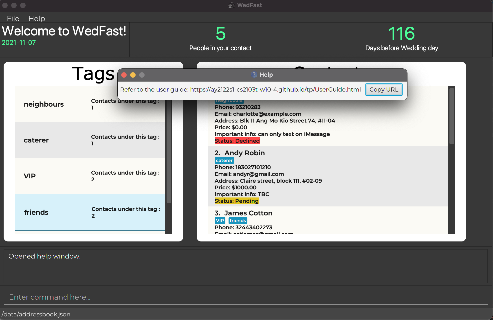

    

---

## **Table of Contents**

* [**Product Overview**](#product-overview)
* [**About This User Guide**](#about-this-user-guide)
  * [How to navigate this guide?](#how-to-navigate-this-guide)
  * [What do these icons mean?](#what-do-these-icons-mean)
  * [What do these formatting mean?](#what-do-these-formatting-mean)
* [**Getting Started**](#getting-started)
  * [Installation](#installation)
  * [Using command-line interface(CLI)](#using-command-line-interface-cli)
* [**Features**](#features)
  * [Viewing help : `help`](#viewing-help--help)
  * [Adding a person : `add`](#adding-a-person--add)
  * [Listing all persons : `list`](#listing-all-persons--list)
  * [Editing a person : `edit`](#editing-a-person--edit)
  * [Grouping persons : `group`](#grouping-persons--group)
  * [Locating persons : `find`](#locating-persons--find)
  * [Deleting a person : `delete`](#deleting-a-person--delete)
  * [Clearing all entries : `clear`](#clearing-all-entries--clear)
  * [Undoing last change : `undo`](#undoing-last-change--undo)
  * [Counting down to the wedding day : `countdown`](#counting-down-to-the-wedding-day--countdown)
  * [Counting head by tag : `tagInfo`](#counting-head-by-tag--taginfo)
  * [Calculating wedding cost : `price`](#calculating-wedding-cost--price)
  * [Getting your wedding plan report : `report`](#getting-your-wedding-plan-report--report)
  * [Using customizable shortcuts : `shortcut`](#using-customizable-shortcuts--shortcut)
  * [Exiting the program : `exit`](#exiting-the-program--exit)
  * [Saving the data file](#saving-the-data-file)
  * [Editing the data file](#editing-the-data-file)
  * [Redoing last change : `redo`](#redoing-last-change--redo-coming-soon) (Coming soon)
  * [Reminding via email : `remind`](#reminding-via-email--remind-coming-soon) (Coming soon)
* [**FAQ**](#faq)
  * [About the program](#about-the-program)
  * [About the command](#about-the-command)
* [**Command Summary**](#command-summary)
* [**Glossary**](#glossary)

---

## **Product Overview**

**_WedFast_ is a desktop app for managing contacts of your dream wedding, optimized for use via a 
[Command Line Interface](#command-line-interface-cli) (CLI) while still having the benefits of a 
[Graphical User Interface](#graphical-user-interface-gui) (GUI).**

You can use _WedFast_ to **add, edit and delete the contacts**. These contacts are not just limited to those attending 
your wedding, it can also be those you are hiring such as your photographer and costume designer. On this basis, 
_WedFast_ allows you to **add tag to these contacts, calculating the cost, and even generating a detailed report for 
your wedding plan!** 

Excited to try _WedFast_ out? This user guide will **walk you through all the latest features, troubleshoots your 
problems and provides you a command summary to boost your efficiency!**

---

## **About This User Guide**

:information_source: Welcome to _WedFast_ user guide!
In this section, you will **learn how to use this guide**.

### How to navigate this guide?
1. **Navigating up or down** this user guide via either of the following methods:
  * Scroll up or down using your mouse wheel.
  * Press ↑ or ↓ button on your keyboard.

2. **Jumping to different section** of this user guide:
  * Click on any content you want to read in [Table of Contents](#table-of-contents).

3. **Finding keywords** in this user guide:
  * Press CTRL + F and type in some keywords.
  * Press Enter to navigate to each keyword found in this user guide.

### What do these icons mean?

**Icon**              | **Meaning**
:---------------------|:-----------------------------
:information_source:  | Important info that you need to take note of
:bulb:                | Useful tip that you might want to know
:exclamation:         | Be cautious when attempting/Things that you should avoid
🔝                    | Back to [Table of Content](#table-of-contents)

### What do these formatting mean?

**Format**           | **Meaning**
:--------------------|:-----------------------------
_Italic text_        | The name of this product or a file path.
**Bold text**        | The focus of a sentence or the table header.
`Text in code block` | A command syntax or an item of interest.
[Text in blue](#what-do-these-formatting-mean)    | A text that you can click to jump to different section of this guide or to a website.
Very large, bold text in Orange  | Heading of a section in this guide.
Large text in Orange | Subheading of a section in this guide.

---

## **Getting Started**

:information_source: This section will teach you step-by-step how to install and use _WedFast_

### Installation
1. Ensure your device runs on **Windows** or **macOS** because _WedFast_ only supports these two operating systems.

2. Ensure you have `Java 11` or above installed in your device. Not sure how to install? [Click me](https://java.com/en/download/help/download_options.html).

3. Download the latest `wedfast.jar` from [here](https://github.com/AY2122S1-CS2103T-W10-4/tp/releases/download/v1.2.1/WedFast.jar).

4. Copy the file to the folder you want to use as the _home folder_ for your _WedFast_.

5. Double-click the file to start the app. The GUI similar to the below should appear in a few seconds.
   Note how the app contains some sample data.
   

### Using command-line interface (CLI)
1. Type the command in the command box and press Enter to execute it. 
   e.g. typing `help` and pressing Enter will open the help window. 
   
2. Some example commands you can try:
   * `list` : Lists all contacts.

   * `add n/John Doe p/98765432 e/johnd@example.com a/John street, block 123, #01-01`: Adds a contact named `John Doe` to the Address Book.

   * `delete 3` : Deletes the 3rd contact shown in the current list.

   * `clear` : Deletes all contacts.

   * `exit` : Exits the app.

3. Congratulation for finishing up the basics! You can refer to the [Features](#features) below for more details of 
   each command.
   
[Back to top 🔝](#table-of-contents)

---

## **Features**

:information_source: **Notes about the command format:** 
This section consists of important note for _WedFast_ command to function properly. 
Rest assured that this guide will provide example to help you better understand each important note below.

No.  | **Note**                                                                                                                                           | **Example**
:---:| :------------------------------------------------------------------------------------------------------------------------------------------------- | :-----------------------------
1    | Words in `UPPER_CASE` are the parameters you need to supplied                                                                                      | In `add n/NAME`, `NAME` is a parameter which can be used as `add n/John Doe`.
2    | Items in square brackets are optional.                                                                                                             | `n/NAME [t/TAG]` can be used as `n/John Doe t/friend` or as `n/John Doe`.
3    | Items with `…`​ after them can be used multiple times including zero times.                                                                     | `[t/TAG]…​` can be used as ` ` (i.e. 0 times), `t/friend`, `t/friend t/family` etc.
4    | Parameters can be in any order.                                                                                                                    | If the command specifies `n/NAME p/PHONE_NUMBER`, `p/PHONE_NUMBER n/NAME` is also acceptable.
5    | If a parameter is expected only once in the command, but you specified it multiple times, only the last occurrence of the parameter will be taken. | If you specify `p/12341234 p/56785678`, only `p/56785678` will be taken.
6    | Extraneous parameters for commands that do not take in parameters (such as `help`, `list`, `exit` and `clear`) will be ignored.                    | If the command specifies `help 123`, it will be interpreted as `help`.

[Back to top 🔝](#table-of-contents)

### Viewing help : `help`
To shows a message on how to access the help page.
1. Type the command: `help` in the command box.
2. Press Enter

Example and expected outcome: 

`PLEASE INSERT TEXT HERE`

**:bulb: Tips:** 
`INSERT HERE IF GOT, ELSE, KINDLY DELETE THIS PART`

### Adding a person : `add`
To add a person to the contact list:

1. Type the command in the command box with the following format: 
`add n/NAME p/PHONE_NUMBER e/EMAIL a/ADDRESS [pr/PRICE] [i/IMPORTANT_INFORMATION] [r/REMINDER] [g/group] [t/TAG]…​`
2. Press Enter.

Example and expected outcome: 
`PLEASE INSERT TEXT AND SCREENSHOTS HERE`

**:exclamation:Caution:** 
`INSERT HERE IF GOT, ELSE, KINDLY DELETE THIS PART`

**:bulb: Tips:** 
`INSERT HERE IF GOT, ELSE, KINDLY DELETE THIS PART`

### Listing all persons : `list`
To lists all the existing contacts.
1. Type the command: `list` in the command box.
2. Press Enter.

Example and expected outcome: 
`PLEASE INSERT TEXT AND SCREENSHOTS HERE`

### Editing a person : `edit`
To edit an existing person in the contact list:
1. Type the command in the command box with the following format: 
   `edit INDEX [n/NAME] [p/PHONE] [e/EMAIL] [a/ADDRESS] [pr/PRICE] [i/IMPORTANT_INFORMATION] [r/REMINDER] [g/group] [t/tag]…​`
2. Press Enter.

Example and expected outcome: 
`PLEASE INSERT TEXT AND SCREENSHOTS HERE`

**:exclamation:Caution:** 
`INSERT HERE IF GOT, ELSE, KINDLY DELETE THIS PART`

**:bulb: Tips:** 
`INSERT HERE IF GOT, ELSE, KINDLY DELETE THIS PART`

### Grouping persons : `group`
To group existing persons in the contact list together to an existing named tag or create a new tag
1. Type the command in the command box with the following format: 
   `group t/GROUP_NAME n/NAME1, NAME2, ...`
2. Press Enter.

Example and expected outcome: 
`PLEASE INSERT TEXT AND SCREENSHOTS HERE`

**:exclamation:Caution:** 
`INSERT HERE IF GOT, ELSE, KINDLY DELETE THIS PART`

**:bulb: Tips:** 
`INSERT HERE IF GOT, ELSE, KINDLY DELETE THIS PART`

### Locating persons : `find`
To find persons whose names contain any of the given keywords, or labelled with same tag, or labelled within the price range.
1. Type the command in the command box with either of the following formats: 
    * `find KEYWORD [MORE_KEYWORDS]` or
    * `find t/TAG [t/MORE_TAG]` or
    * `find pr/PRICE_RANGE`
2. Press Enter.

Example and expected outcome: 
`PLEASE INSERT TEXT AND SCREENSHOTS HERE`

**:exclamation:Caution:** 
`INSERT HERE IF GOT, ELSE, KINDLY DELETE THIS PART`

**:bulb: Tips:** 
`INSERT HERE IF GOT, ELSE, KINDLY DELETE THIS PART`

### Deleting a person : `delete`
To delete a person from the contact list via index/name/tag:
1. Type the command in the command box with either of the following formats: 
    * `delete INDEX` or  
    * `delete n/NAME` or  
    * `delete t/TAG`
2. Press Enter.

Example and expected outcome: 
`PLEASE INSERT TEXT AND SCREENSHOTS HERE`

**:exclamation:Caution:** 
`INSERT HERE IF GOT, ELSE, KINDLY DELETE THIS PART`

**:bulb: Tips:** 
`INSERT HERE IF GOT, ELSE, KINDLY DELETE THIS PART`

### Clearing all entries : `clear`
To clear all entries in the contact list:
1. Type the command: `clear` in the command box.
2. Press Enter

Example and expected outcome: 
`PLEASE INSERT TEXT AND SCREENSHOTS HERE`

**:exclamation:Caution:** 
`INSERT HERE IF GOT, ELSE, KINDLY DELETE THIS PART`

**:bulb: Tips:** 
`INSERT HERE IF GOT, ELSE, KINDLY DELETE THIS PART`

### Undoing last change : `undo`
To undo the last change that was made to the contact list.
1. Type the command: `undo` in the command box.
2. Press Enter.

Example and expected outcome: 
`PLEASE INSERT TEXT AND SCREENSHOTS HERE`

**:exclamation:Caution:** 
`INSERT HERE IF GOT, ELSE, KINDLY DELETE THIS PART`

**:bulb: Tips:** 
`INSERT HERE IF GOT, ELSE, KINDLY DELETE THIS PART`

### Counting down to the wedding day : `countdown`
To check the countdown till your wedding day:
1. Type the command in the command box with the following format: 
   `countdown YYYY-MM-DD`
2. Press Enter.
3. Your wedding date has now been updated.
4. Type `countdown` in the command box and press Enter to check the countdown based on the wedding date 
   set.
5. Repeat step (1) and step (2) again if you wish to reset the wedding date.

Example and expected outcome: 
`PLEASE INSERT TEXT AND SCREENSHOTS HERE`

**:bulb: Tips:** 
1. If you have not set the wedding date before, then the default wedding date will be today.
2. If you had set the wedding date before, then you can follow step (4) ONLY to check the countdown.

### Counting head by tag : `tagInfo`
Filters through the contacts with tags TAG to obtain a list of TAGs with details of how many contacts labelled by them.

To return a unique list of tags with the number of contacts labelled with the tag.
1. Type the command in the command box with either of the following formats: 
   * `tagInfo [t/TAG]...` or
   * `tagInfo list`
2. Press Enter

Example and expected outcome: 
* `tagInfo t/male, colleagues` tag Info: males used by 3 people, colleagues used by 5 people
* `tagInfo list` returns a list with all the tags labelled by the contacts.

**:exclamation:Caution:** 
`INSERT HERE IF GOT, ELSE, KINDLY DELETE THIS PART`

**:bulb: Tips:** 
The list can be specified to only limited tags or to include all the tags used to label the contacts.`

### Calculating wedding cost : `price`
To calculate the wedding cost:
1. Type the command: `price` in the command box.
2. Press Enter

Example and expected outcome: 
`PLEASE INSERT TEXT AND SCREENSHOTS HERE`

**:exclamation:Caution:** 
`INSERT HERE IF GOT, ELSE, KINDLY DELETE THIS PART`

**:bulb: Tips:** 
`INSERT HERE IF GOT, ELSE, KINDLY DELETE THIS PART`

### Getting your wedding plan report : `report`
To 
1. Type the command: `report` in the command box.
2. Press Enter

Example and expected outcome: 
`PLEASE INSERT TEXT AND SCREENSHOTS HERE`

**:exclamation:Caution:** 
`INSERT HERE IF GOT, ELSE, KINDLY DELETE THIS PART`

**:bulb: Tips:** 
`INSERT HERE IF GOT, ELSE, KINDLY DELETE THIS PART`

### Using customizable shortcuts : `shortcut`
To add a shortcut bound to the SHORTCUT button
1. Type the command in the command box with either of the following formats: 
    * 
2. Press Enter

Example and expected outcome: 
`PLEASE INSERT TEXT AND SCREENSHOTS HERE`

**:exclamation:Caution:** 
`INSERT HERE IF GOT, ELSE, KINDLY DELETE THIS PART`

**:bulb: Tips:** 
`INSERT HERE IF GOT, ELSE, KINDLY DELETE THIS PART`

### Exiting the program : `exit`
To exit the app.
1. Type the command: `exit` in the command box.
2. Press Enter

Example and expected outcome: 
`PLEASE INSERT TEXT AND SCREENSHOTS HERE`

### Saving the data file
_WedFast_ data are saved in the hard disk automatically after any command that changes the data. There is no need to 
save manually.

### Editing the data file
_WedFast_ data are saved as a JSON file `[JAR file location]/data/addressbook.json`. Advanced users are welcome to 
update data directly by editing that data file.

:warning: **Caution:**
If your changes to the data file makes its format invalid, _WedFast_ will discard all data and start with an empty data 
file at the next run.

### Redoing last change : `redo` (Coming soon)
_Details coming soon …_

### Reminding via email : `remind` (Coming soon)
_Details coming soon …_

[Back to top 🔝](#table-of-contents)

---

## **FAQ**
### About the program
**Q**: How do I transfer my data to another Computer? 
**A**: Install the app in the other computer and overwrite the empty data file it creates with the file that contains 
       the data of your previous _WedFast_ home folder.

### About the command
{More will be added in the future...}

[Back to top 🔝](#table-of-contents)

---

## **Command Summary**

**Actions**                           | **Format**                        | **Example**
--------------------------------------|-----------------------------------|------------ 
**Viewing help**                      | `help`                            | 
**Adding a person**                   | `add`                             |
**Listing all persons**               | `list`                            |
**Editing a person**                  | `edit`                            |
**Grouping persons**                  | `group`                           |
**Locating persons**                  | `find`                            |
**Deleting a person/persons**         | `delete INDEX` or `delete n/NAME` or  `delete t/TAG`|`delete 3` or `delete n/Alex Yeoh` or `delete t/food_vendor`
**Clearing all entries**              | `clear`                           |
**Undoing last change**               | `undo`                            |
**Counting down to the wedding day**  | `countdown YYYY-MM-DD` (To set your wedding date) `countdown` (To see the day count)|`countdown`  `countdown 2021-10-26`
**Counting head by tag**              | `tagInfo`                         |
**Calculating wedding cost**          | `price`  or `price t/TAG1 [t/TAG2]…​`| `price` or `price t/Chef` or `price t/Chef t/Photographer`
**Getting your wedding plan report**  | `report`                          |
**Adding customizable shortcuts**     | `shortcut`                        |
**Exiting the program**               | `exit`                            |

[Back to top 🔝](#table-of-contents)

---

## **Glossary**

##### App
An abbreviated form of the word "application". An application is a software program that's designed to perform a 
specific function directly for the user. In this user guide, it refers to _WedFast_ itself.

##### Command-line interface (CLI)
A command-line interface processes commands to a computer program in the form of lines of text.

##### FAQ
An abbreviation for the words "frequently asked questions".

##### Graphical user interface (GUI)
A form of user interface that allows users to interact with electronic devices through graphical icons and audio 
indicator

##### JSON
Stands for JavaScript Object Notation. It is a lightweight data-interchange format. It is easy for humans to read and
write and easy for machines to parse and generate data.

[Back to top 🔝](#table-of-contents)

---